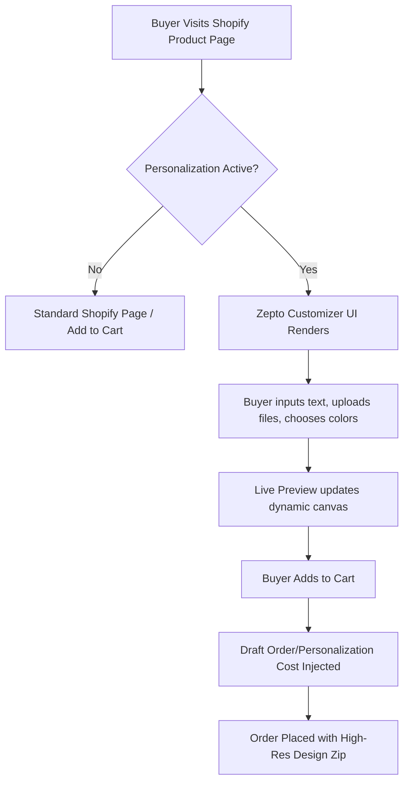

# Zepto Product Personalizer: Comprehensive Feature & Settings Guide

This document provides a highly detailed, professional documentation for the **Zepto Product Personalizer** Shopify app, based on a comprehensive system research. It serves as an exhaustive reference for store managers, designers, and developers to manage, customize, and optimize the personalization experience for buyers.

---

## 📽️ Browser Exploration Session Recording
Below is the video recording captured during our comprehensive automated browsing of the Product Personalizer dashboard inside your Shopify admin panel:


---

## Table of Contents
1. [Overview & Store Metrics Dashboard](#1-overview--store-metrics-dashboard)
2. [Interactive Customizer Editor & Option Types](#2-interactive-customizer-editor--option-types)
3. [Templates Architecture](#3-templates-architecture)
4. [Global Asset Directory Management](#4-global-asset-directory-management)
5. [Order Fulfillment & Manufacturing Data Workflow](#5-order-fulfillment--manufacturing-data-workflow)
6. [Pricing & Subscription Plans](#6-pricing--subscription-plans)
7. [Global Settings Deep-Dive](#7-global-settings-deep-dive)
8. [Merchant & Developer Options](#8-merchant--developer-options)

---

## 1. Overview & Store Metrics Dashboard

The main dashboard functions as the command center for the personalization app. It gives merchants an immediate snapshot of storefront health, active customizations, and plan limits.

### Active App Status
* **Theme Integration:** The customizer is fully active on the live Shopify theme.
* **Current Active Plan:** Moderate ($29.99/month).

### Store Quota & Usage Metrics

| Metric | Current Usage | Maximum Quota Limit | Percentage Used |
| :--- | :--- | :--- | :--- |
| **Customizable Products** | 460 products | 500 products | 92.0% |
| **Customized Orders** | 0 orders | 500 orders / billing cycle | 0.0% |
| **Custom Templates** | 3 templates | Unlimited | Unlimited |
| **Asset Storage** | 174.89 KB | 1.00 GB | 0.02% |

> [!NOTE]
> The store is currently approaching its customizable products limit (460/500). Upgrading to the **Unlimited** plan ($49.99/mo) will unlock infinite customizable products and orders.

### Quick Learning Center
The dashboard contains direct tutorials and guides for onboarding, focusing on:
* Setting up custom text with bespoke Google Fonts or merchant-loaded `.ttf`/`.otf` font files.
* Constructing beautiful letter monogram designs (perfect for jewelry, leather, and embroidery stores).
* Establishing conditional logic (showing/hiding options dynamically based on buyer selections).

---

## 2. Interactive Customizer Editor & Option Types

The product listing view lists all Shopify store products. Merchants can toggle personalization **On/Off** for individual items with a single click and access the **Customizer Editor** modal.



### The Customizer Interface
The workspace inside the Editor modal consists of two primary panels:
1. **Left Control Panel (Layers & Elements Control):** Where options are built, ordered, and formatted.
2. **Right Canvas Panel (Live Preview Panel):** A live WYSIWYG rendering canvas that updates in real-time as elements are added or modified. The live preview can be toggled on or off depending on the builder's preferences.

### The 10 Personalization Element Types
Store owners can construct a customized form by mixing and matching 10 distinct option types:

1. **Text Single Line:** 
   * *Best For:* Names, initials, dates, short phrases.
   * *Capabilities:* Customizable font styles, size bounds, orientation, character limits, and color palettes.
2. **Text Area Multi-Line:**
   * *Best For:* Gift cards, long quotes, custom letters, greetings.
   * *Capabilities:* Height/width bounds, character counts, and sizing constraints.
3. **Text Placeholder:**
   * *Best For:* Injecting dynamic product options or variants into specific positions on the customization layer.
4. **Upload Button:**
   * *Best For:* Allowing buyers to supply logos, hand-drawn art, personal portraits, or vector templates.
   * *Capabilities:* Upload constraints, custom crop ratios, image size requirements.
5. **Image Choices (Swatches):**
   * *Best For:* Visual selections (e.g., choice of background pattern, custom borders, preset clip-arts, base materials).
   * *Capabilities:* Multi-select or single-select swatches with custom thumbnail visuals.
6. **Image Placeholder:**
   * *Best For:* Designated photo boxes where the buyer's uploaded image automatically fits and renders with perspective/masking.
7. **Color Choices (Color Swatches):**
   * *Best For:* Color overlays on fabrics, text coloring, or metal selections (e.g., gold, silver, rose-gold).
   * *Capabilities:* Palette mappings, hex-to-display name conversions.
8. **Button Options:**
   * *Best For:* Quick selection triggers, binary toggles (e.g., "Add Gift Wrap?", "Double Sided Print?").
9. **Dropdown Menu:**
   * *Best For:* Compacting extensive lists (e.g., country dropdowns, font size tiers, packaging selections).
10. **Checkbox Toggle:**
    * *Best For:* Upcharge agreements, optional add-on products, terms of service agreements.

---

## 3. Templates Architecture

Rather than setting up personalization fields manually for every single product, Zepto supports a modular **Templates** setup.

* **Built-in System Templates:** Preconfigured templates representing common product setups:
  * *Chronos C-200 Series:* Model for wristwatches, allowing custom engraved backplates and watchstrap variants.
  * *Create Your Neon:* Neon text effect layout featuring highly stylized font styles and dynamic glowing neon color combinations.
  * *Custom Pillow with Monogram:* Pre-masked setups showing visual monograms dynamically overlaid on standard cotton throw pillows.
  * *Full Personalized Tshirt:* Apparel layout combining screenprint dimensions, sizing dropdowns, and customizable image overlays.
* **Your Custom Templates:** Store-owner built templates. Merchants can construct a template once and bulk-apply it to hundreds of products across the storefront simultaneously, dramatically reducing configuration times. Includes features to clone, edit, or decouple templates.

---

## 4. Global Asset Directory Management

The **Assets Directory** is a centralized library where store owners store global assets that are shared among multiple customizers. Modifying an asset set here propagates the changes to all products using it.

```
📁 Assets Directory
├──  Fonts
│   ├── Font Set: "Vintage Fonts" (e.g., VintageScript.ttf, BoldRetro.otf)
│   └── Custom Font Uploads (.ttf, .otf, .woff)
├──  Colors
│   └── Color Set: "Leather Colors" (e.g., Tan -> #D2B48C, Cocoa -> #3E2723)
├──  Images
│   └── Image Set: "Custom Patterns" (e.g., Camo.png, Floral.jpg, Polka.jpg)
└──  Options
    └── Option Set: "Ring Sizes" (e.g., Size 5, Size 6, Size 7)
```

1. **Fonts ():** Supports importing custom files (`.ttf`, `.otf`, `.woff`). Store managers can organize these into **Font Sets** (e.g., "Script Fonts", "Block Lettering") to present specific selections to buyers.
2. **Colors ():** Creates globally reusable **Color Sets** where hex values are bound to localized labels (e.g., `#27A9E1` as "Cream Blue").
3. **Images ():** Houses **Image Sets** for swatches. Ideal for cataloging preset design graphics, decals, embroidery templates, or material patterns.
4. **Options ():** Handles reusable dropdown/checkbox option configurations (e.g., standard apparel sizes, custom jewelry chain lengths) to avoid manually typing list items in multiple customizer configurations.

---

## 5. Order Fulfillment & Manufacturing Data Workflow

The **Orders** interface tracks and matches customized purchases directly with backend fulfillment operations.

* **Database Synchronization:** Features a manual/automatic sync trigger to re-fetch Shopify orders instantly, ensuring zero delays between checkout and backend tracking.
* **Fulfillment Data Downloading:** Merchants can bulk-download or single-download complete customization datasets. The downloaded package is compiled into a tidy `.zip` format containing:
  * The exact buyer text choices and formatting parameters.
  * Precise X and Y coordinate placements, sizing scale, and rotation angles.
  * High-resolution uploaded graphics provided by the customer.
  * Vector mask layouts and layered files.
* **Filtering Systems:** Provides filters to narrow down orders by order number, date brackets, or customization status (Pending Processing vs. Sent to Manufacturing).

---

## 6. Pricing & Subscription Plans

Subscription tiers are billed directly through Shopify App Billing and scale depending on the store’s inventory and order volume:

| Plan Name | Monthly Price | Customizable Products Limit | Customized Orders Limit | Core Features |
| :--- | :--- | :--- | :--- | :--- |
| **Starter** | $9.99 / mo | Up to 50 | Up to 100 / mo | Unlimited options, conditional logic, upcharge pricing. |
| **Basic** | $19.99 / mo | Up to 200 | Up to 300 / mo | All option types, template setups, global assets. |
| **Moderate** *(Current)* | $29.99 / mo | Up to 500 | Up to 500 / mo | Full access, priority styling, high-res canvas exports. |
| **Unlimited** | $49.99 / mo | Unlimited | Unlimited | Unlimited products, unlimited monthly customized orders. |

---

## 7. Global Settings Deep-Dive

The global settings portal provides absolute control over how the customizer operates, presents itself, and charges users.

### Theme & Styling Settings
* **App Installation Integration:** Simple selection controls to inject app scripts into Shopify’s online store themes and deep links to activate app blocks in Shopify 2.0 Theme Customizers.
* **Layout Variations:** Choice between **Normal** layout (stacked input options alongside/below product photos) and **Dynamic Tabs** (options organized into tab categories like "Text", "Images", "Accessories" to reduce page clutter).
* **Interactivity Enhancements:** Options for sticky desktop previews (the product image floats in view while scrolling through options) and hover-zoom effects.
* **Full Design Palette Control:** Custom color pickers to control:
  * Background containers & border paddings.
  * Text options labels, hints, and error tooltips.
  * Swatch outline colors (normal vs. active selection indicators).
  * Action button coloring (e.g., "Add Personalization", "Save Design").

### Modal & Popup Customizer Controls
* **Sizing Options:** Configurable between a sleek partial overlay modal or a complete fullscreen customizer screen.
* **Quantity Fields:** Toggle inline quantity boxes directly inside the customizer modal.
* **Add to Cart Labels:** Customize text labels on customizer checkout buttons (e.g., "Confirm Design & Add to Cart").

### Text & Textarea Mechanics
* **Auto-Resize Inputs:** Automatically shrinks text size inside the preview box when a customer inputs long strings, preventing clipping.
* **Visual Character Counters:** Displays live indicators (e.g., "12 / 20 characters") under input fields.
* **Extra Keyboards:** Enables merchants to define custom symbol panels. If enabled, a small panel of merchant-selected characters (e.g., `♥, ☻, ★, ✝, ⚓, ♾`) appears above input boxes, allowing users to quickly copy/paste symbols that standard keyboards lack.

### Image Upload Parameters
* **Cropping Constraints:** Setup fixed aspect ratios (e.g., force a 1:1 square crop or a 16:9 widescreen crop) for buyer uploads.
* **UI Customization:** Customize upload button text labels, upload loading status messages, and warning texts for low-resolution uploads.

### Post-Cart Action & Validation
* **Screen Saving Indicators:** Displays a dynamic loading animation (e.g., "Generating print file...", "Saving options...") when the user clicks Add to Cart.
* **Checkout Redirect Rules:**
  1. *Stay on Page:* Allows the customer to remain on the product page.
  2. *Redirect to Cart:* Sends the customer straight to the `/cart` page.
  3. *Redirect to Checkout:* Instantly pushes the customer to the secure checkout portal.
* **Cart Previews:** Option to override standard product thumbnails in the cart and checkout pages with a dynamic image showing the buyer's exact personalized preview design.

---

## 8. Merchant & Developer Options

Zepto provides advanced controls to ensure precise product print quality and enable deeper customizations.

### Print Quality Settings
* **High-Resolution Exports:** Configure output resolutions ranging from normal screen-density (72 DPI) up to professional print-ready density (**300 DPI**).
* **Export Formats:** Supports high-resolution exports as premium **PDF** vectors or transparent **PNG** files, making it instantly compatible with DTG (Direct-to-Garment) printing, engraving machines, and sublimation layouts.

### Option Upcharge Pricing
Allows merchants to add extra costs to specific options (e.g., +$5.00 for engraving, +$10.00 for custom uploads).
* **Draft Order Upcharge Workflow:** Integrates with Shopify’s checkout backend. When an upcharge option is selected, the customizer dynamically injects a custom line item named:
  `{{ product_title }} - Personalization Cost`
  with the matching fee.
* **Financial Settings:** Toggles to configure whether personalization fees are subject to product taxes and shipping calculations.

### Custom Scripts Editor
For custom styling and advanced integration, developers can write raw overrides inside the admin dashboard:

> [!TIP]
> Custom scripts and styling rules are injected directly into storefront headers safely without modifying original theme source files.

* **Custom CSS Editor:** A blank editor designed to write CSS declarations. (e.g., targeting `.zepto-customizer-option` classes to change layout borders or custom fonts).
* **Custom JS Editor:** An editor to inject raw Javascript event-listeners. Perfect for tracking events (e.g., Google Analytics / Meta Pixel event fires when customizer options are opened, altered, or completed).

---
*End of Documentation. Prepared for africazones-store.*
