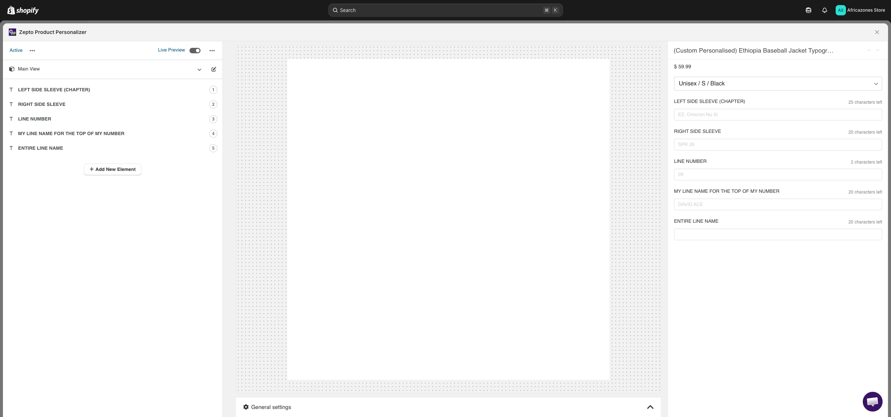
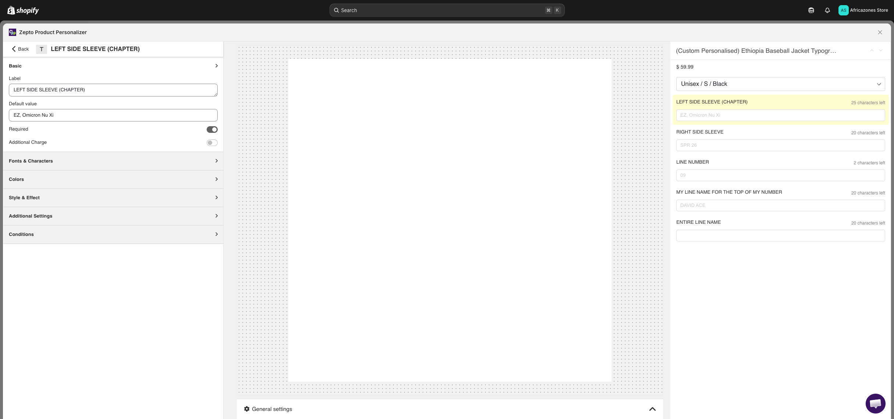
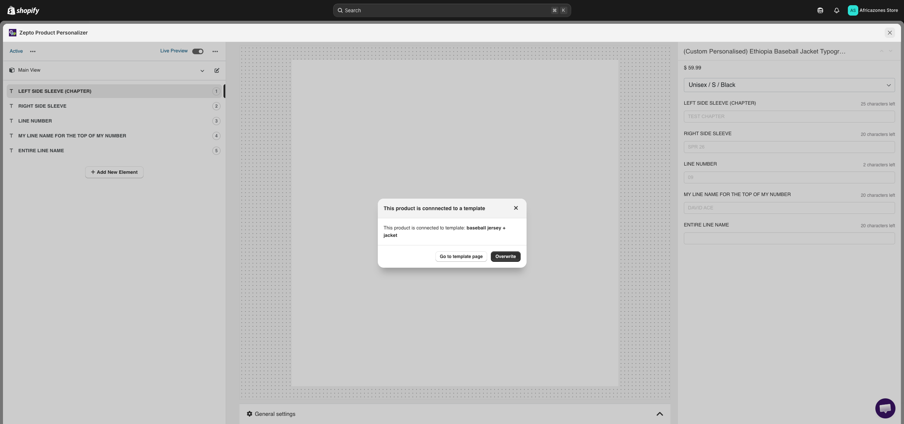
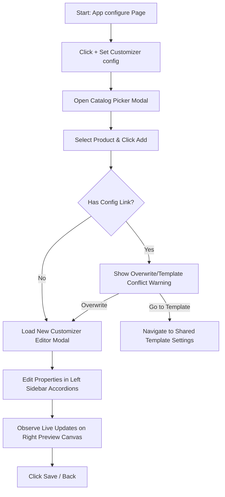
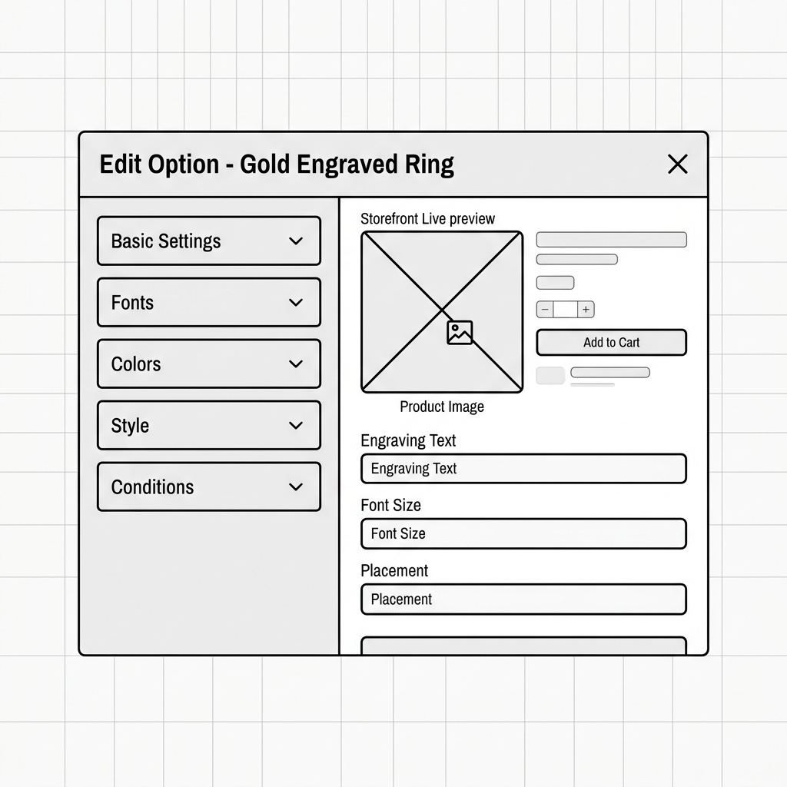
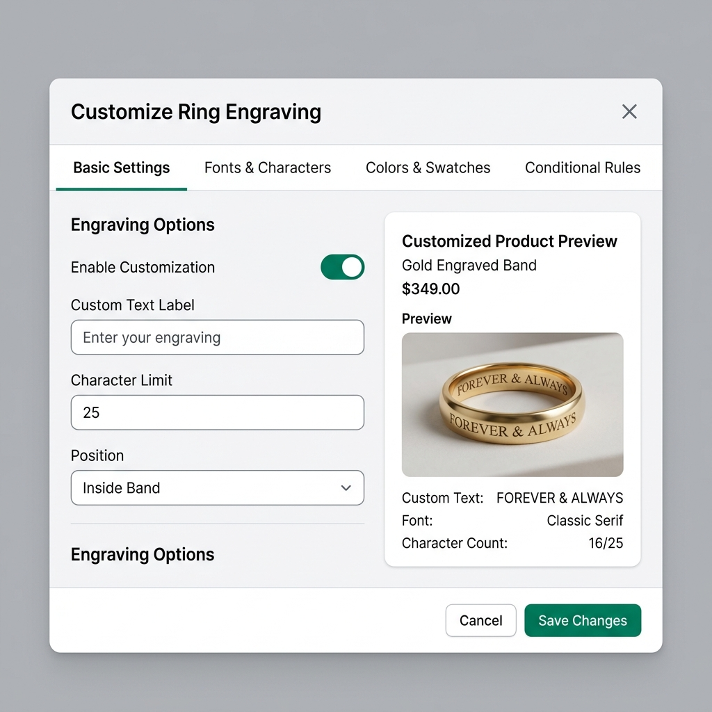

# UI/UX Research & Audit: Zepto Product Personalizer Add Product Option UI

* **Date:** 2026-06-04
* **Target URL:** [https://admin.shopify.com/store/africazones-store/apps/product-personalizer/configure](https://admin.shopify.com/store/africazones-store/apps/product-personalizer/configure)
* **Focus Area:** Product Options Tab - Add new Production Option UI (Catalog selection flow, options initialization, customization editor overlay modal, and template conflict states).

---

## 0. Visual Reference & Exploration Recording

### Exploration Recording
* [Exploration Recording](assets/zepto-product-personalizer_add-product-option/recording.webm)
*(Note: An interactive screen recording of the browser exploration session is saved as `recording.webm` inside the assets directory.)*

### Audited UI States

| Audited UI State | Visual Link |
| :--- | :--- |
| **Customizer Overlay Modal (Initial Layout)** |  |
| **Property Editor Drawer (Editing Element)** |  |
| **Template Overwrite / Connection Warning Dialog** |  |

---

## 1. Overview
The **Add Product Option UI** is the entry gateway for merchants to configure custom options on a store product. It bridges the transition from catalog browsing to detailed option specification. 

When a merchant adds a product option configuration, the app launches a multi-pane options customizer editor within a modal overlay. The primary utility of this interface is to allow merchants to define engraving fields, swatches, file uploads, and conditional logic. It also supports linking configuration templates across products. If a selected product is already tied to a template, the interface handles conflict states by presenting warning dialogs that allow the user to overwrite settings or edit the shared template.

---

## 2. User Persona

### Primary Persona: Elena, Custom Product Designer
* **Goals:**
  * Quickly add personalized elements (like color swatches, font pickers, and text engravings) to a newly selected product.
  * Understand if the chosen product is already linked to an existing personalization template before making changes.
  * Customize product-specific inputs without accidentally breaking shared shop templates.
* **Pain Points:**
  * Double-scrolling windows when configure forms are nested inside scrollable overlay frames.
  * Visual fragmentation from custom-built components (like legacy sliders, toggles, and color inputs) that don't match the modern Shopify Admin styles.
  * Severe data loss risk when closing modals since there is no prominent unsaved changes validation.
  * Ambiguity around template warning dialogs (e.g. "Overwrite configuration" vs "Go to template page") that lack clear impact summaries.

---

## 3. Key Features & Functionalities

### A. Catalog picker modal
* **Visual & Aesthetic Design:** A clean, centered overlay panel showing a searchable list of products with check-boxes.
* **Trigger & Interaction:** Clicking "+ Set Customizer config" triggers the modal. Checking a box and clicking "Add" initializes option templates.
* **Validation & Logic Checks:** The "Add" CTA remains disabled until a selection checkbox is ticked.

### B. Customization editor modal overlay
* **Visual & Aesthetic Design:** A full-screen overlay modal split into a Left Property Panel (collapsible accordion groups) and a Right Live Preview Canvas.
* **Trigger & Interaction:** Click-based controls. Selecting an element (e.g. `LEFT SIDE SLEEVE`) in the Left Panel sidebar expands edit fields (Labels, default values, max-characters, conditional rules) in the settings drawer. The storefront product page on the Right Canvas updates in real-time.
* **Validation & Logic Checks:** Form fields enforce max-character count limits with a spinner input and display characters-left indicators.

### C. Conflict alert warning modal
* **Visual & Aesthetic Design:** An orange/red alert badge card shown if the selected product is already configured or connected to a template.
* **Trigger & Interaction:** Displays immediately upon trying to save changes. Buttons provide choices: "Overwrite configuration", "Go to template page", or "Cancel".
* **Validation & Logic Checks:** Prevents accidental overwrites of shared template settings.

---

### 3.1 UI Component & Element Inventory

| Component / Element Name | Type (Button, Dropdown, Toggle, Card, Input) | Default State / Value | Layout Placement & Parent Container |
| :--- | :--- | :--- | :--- |
| **Add Product Option** | Button | Active / Visible | Page Header (Top-Right) |
| **Modal Catalog Search** | Input | Empty | Header of Catalog Picker Modal |
| **Modal Add Button** | Button | Disabled (until selected) | Footer of Catalog Picker Modal |
| **Close Modal (X)** | Button | Active | Top-Right of Modal Headers |
| **Editor Sidebar Group** | Card (Collapsible Accordion) | Collapsed | Left Pane of Customizer Modal |
| **Required Toggle** | Toggle Switch | Inactive (Off) | Sidebar Basic Settings Panel |
| **Additional Charge Toggle**| Toggle Switch | Inactive (Off) | Sidebar Basic Settings Panel |
| **Character Count Spinner** | Input (Number/Spinner) | `100` | Sidebar Fonts & Characters Panel |
| **Live Preview Canvas** | Card | Active | Right Pane of Customizer Modal |
| **Storefront Add-to-Cart** | Button | Active | Preview panel footer |
| **Template Warning Banner** | Card (Alert Banner) | Visible (on conflicts) | Conflict Overwrite Warning Dialog |
| **Go to template page** | Button | Active | Conflict Overwrite Warning Footer |
| **Overwrite** | Button | Active | Conflict Overwrite Warning Footer |

---

## 4. User Flow & Information Architecture

### Branching User Flow



### Page Information Hierarchy
```
Customizer Overlay Modal Root
├─ Header: Product Title & Active Status Toggle
├─ Split Canvas Container
│  ├─ Left Sidebar: Option Layers Directory
│  │  ├─ Option Element Cards (e.g. LEFT SIDE SLEEVE, FRONT ENGRAVING)
│  │  └─ Primary Button: "+ Add New Element"
│  ├─ Middle Sidebar: Property Configuration Drawer (Slide Accordion)
│  │  ├─ Accordion 1: Basic (Label, Default Value, Required, Upcharge)
│  │  ├─ Accordion 2: Fonts & Characters (Font style, Size, Max characters limit)
│  │  ├─ Accordion 3: Colors (Color palettes, Default HEX value)
│  │  └─ Accordion 4: Conditions & Rules (Linkages, dependency targets)
│  └─ Right Sidebar: Interactive Storefront Live Preview
│     ├─ Live Variant Selection (e.g. Size, Color dropdowns)
│     ├─ Personalization Text Inputs (Dynamic text overlays on product image)
│     └─ Buy Block: Price Indicator & Add-to-Cart Button
└─ Footer: Close Modal (X) / Save Configuration / Discard Changes
```

---

## 5. Visual Styling System (Color, Typography, Spacing)

Audited design parameters extracted from the Add Product Option UI:

* **Color Palette:**
  * **Overlay Background Mask:** `rgba(0,0,0,0.5)` (Semi-transparent black overlay)
  * **Container Backgrounds:** `#ffffff` (Sidebar drawers, preview cards, modals)
  * **Secondary Sidebar Panels:** `#f6f6f7` (Accordion headers and background)
  * **Primary Alert Color:** Orange/Red `#de3618` (Alert/Warning headers and warning banners)
  * **Text/Indicator Highlight:** `#160de9` (Blue text links and active fields)
  * **Standard Text:** `#202223` (Labels, inputs, primary text)
* **Typography:**
  * **Font Stack:** `-apple-system, BlinkMacSystemFont, "Segoe UI", Roboto, sans-serif`
  * **Sidebar Labels:** `13px` weight `500`
  * **Meta Description Text:** `11px` - `12px` weight `400`
  * **Warning Header Text:** `16px` weight `700`
* **Spacing, Corners & Elevation:**
  * **Paddings:** `16px` sidebar grid margins, `12px` accordion block padding.
  * **Border Radii:** `6px` for text inputs and dropdown select boxes, `4px` for buttons.
  * **Shadows:** `0 2px 8px rgba(0,0,0,0.15)` on popup warnings and overlays.

---

## 6. UI/UX Analysis (Core Audit)

### Heuristic Evaluation

1. **Visibility of System Status:**
   * *Pros:* Live preview panel is highly reactive, showing characters left (e.g., "16/25") and rendering font changes immediately.
   * *Cons:* When loading options or initializing configuration templates, a brief white screen appears. This lacks a loading skeleton, causing layout shifts.
2. **Match Between System and Real World:**
   * *Pros:* Accordion section headers ("Basic", "Fonts", "Colors") use standard terminology that matches options customizers.
   * *Cons:* Options like "Field heading as tab" are ambiguous and require inline labels or tooltip helper descriptions to prevent merchant confusion.
3. **Consistency and Standards:**
   * *Pros:* Uses standard Shopify buttons and text inputs where possible.
   * *Cons:* Mixing customized orange warning bars, blue text links, and dark bootstrap buttons creates visual inconsistency that differs from Shopify's Polaris styling guidelines.
4. **User Control and Freedom:**
   * *Pros:* Easy close buttons (X) on all modals allow users to return to the catalog index at any point.
   * *Cons:* Triggering bulk actions or template links doesn't have an automated "Undo" option, requiring manual removal of options.

### Pros
* **Highly Reactive Canvas:** Storefront preview updates within milliseconds of character changes.
* **Granular Options Control:** Integrates character limit restrictions, upcharges, and styling overrides into a unified property panel.
* **Safe Template Previews:** Alert warnings prevent users from unknowingly editing linked configurations.

### Cons & Friction Points
* **Nested Accordion Scrollbars:** Editing custom properties opens nested accordion sections, forcing merchants to scroll through multiple nested sidebars.
* **Visual Styling Disconnect:** Warning modals and alerts use bright custom colors that clash with standard Polaris styling.
* **High Data Loss Risk:** Closing the editor modal does not consistently trigger a prompt to save or discard changes, risking configuration loss.

---

## 7. Technical UI Design Deliverables

### Low-Fidelity UX Skeleton Wireframe
The wireframe maps the layout grid structure, emphasizing the side-by-side editing pane and live storefront preview container.



### High-Fidelity Mockup Specification
The redesigned mockup updates the settings drawer by replacing stacked accordions with horizontal navigation tabs. It also uses standard Shopify Polaris switches, buttons, and layouts.



#### Recommended Design Tokens
* **Accent Colors:** Primary Polaris green `#008060` (Save CTA), Secondary neutral gray outline `#babfc3` (Cancel).
* **Sidebar Inputs:** Standardize text font size at `14px` with a font family of `Inter, sans-serif`.
* **Elevations:** Use clean light gray borders (`1px solid #e1e3e5`) on input containers rather than custom drop shadows.
* **Corner Roundness:** Modals rounded at `8px`, form text inputs and toggles rounded at `6px`.

---

## 8. Design Recommendations & Actionable Improvements

| Recommended Action | Impact | Effort | Priority |
| :--- | :--- | :--- | :--- |
| **Horizontal Navigation Tabs:** Replace the long vertical accordion scrollbars in the settings drawer with horizontal navigation tabs (Basic, Fonts, Colors, Rules) to prevent nested scroll exhaustion. | **High** | **Medium** | **High** |
| **Polaris Style Alignment:** Update all switches, alerts, inputs, and action buttons to use Shopify Polaris elements to match the general Shopify Admin app theme. | **High** | **Medium** | **High** |
| **Unsaved Changes Confirmation:** Integrate a browser validation dialog to warn merchants about unsaved option changes when they click the close/exit buttons. | **High** | **Low** | **High** |
| **Helper Tooltips:** Add hover tooltips `(?)` for advanced features like "Field heading as tab" and "Hide fields informations from Cart and Checkout". | **Medium** | **Low** | **Medium** |
| **Template Impact Details:** Expand conflict alerts to show exactly which other products will be affected if the shared template is overwritten. | **Medium** | **Medium** | **Low** |

---

## 9. Conclusion
The **Add Product Option UI** provides custom product options capabilities. However, legibility, consistency, and usability are compromised by legacy accordion scrollbars and non-standard visual elements. Transitioning from stacked accordions to horizontal tabs, standardizing buttons with Polaris guidelines, and implementing an unsaved changes confirmation dialog will improve usability, prevent configuration loss, and deliver a modern software experience.

---

## 10. Open Questions / Clarifications

### Clarification Questions
1. **Dynamic Font Management:** Should merchants be able to upload custom fonts (`.ttf` / `.otf`) directly within the "Fonts & Characters" settings panel, or should we continue to restrict font choices to pre-installed Google Fonts sets?
2. **Template Decoupling Flow:** When a template warning is shown, should we include a direct option to "Clone & Decouple" (i.e. copy the options to a new standalone configuration for this product, leaving the original template untouched)?

### Manual Exploration Recommendations
* **Micro-interactions:** Test the Max-Characters input spinner limits to verify validation messages update in the preview when typing long words.
* **System Integrations:** Validate how personalized text selections are stored in the cart properties to confirm it doesn't cause truncation issues at checkout.
* **Out-of-Scope Connected Flows:** Inspect the Templates dashboard page linked from "Go to template page" to ensure options match between templates and standalone configurations.
