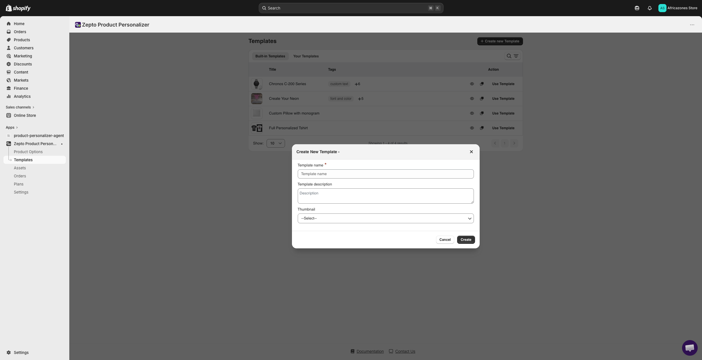
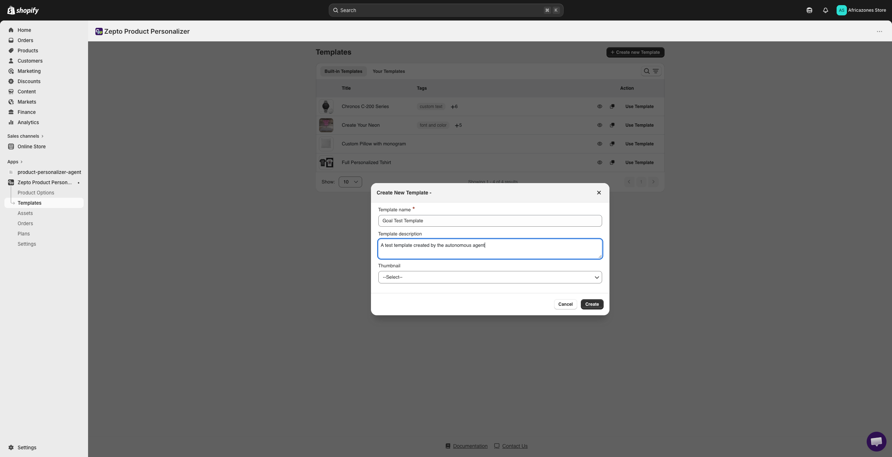
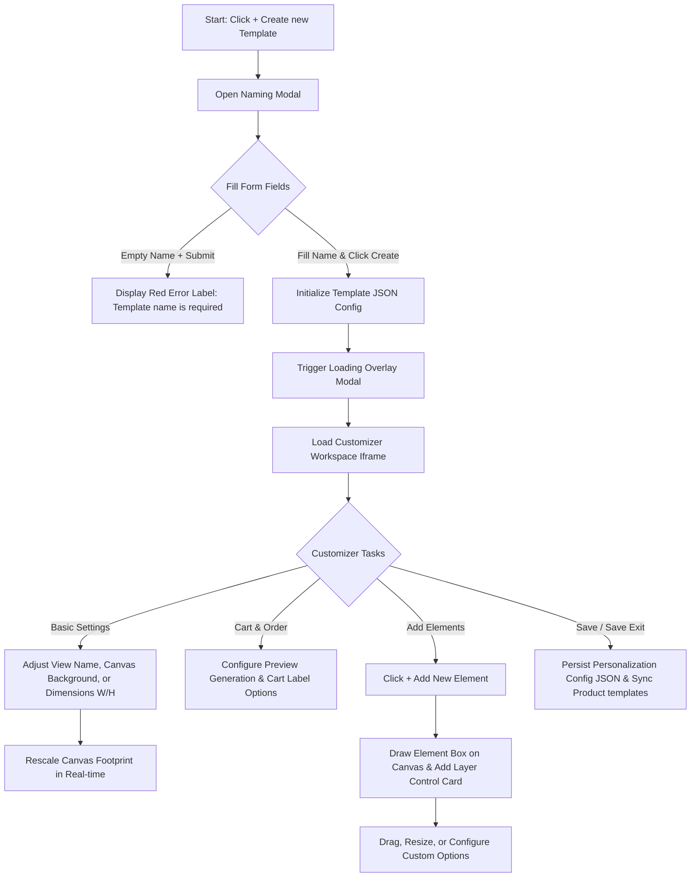
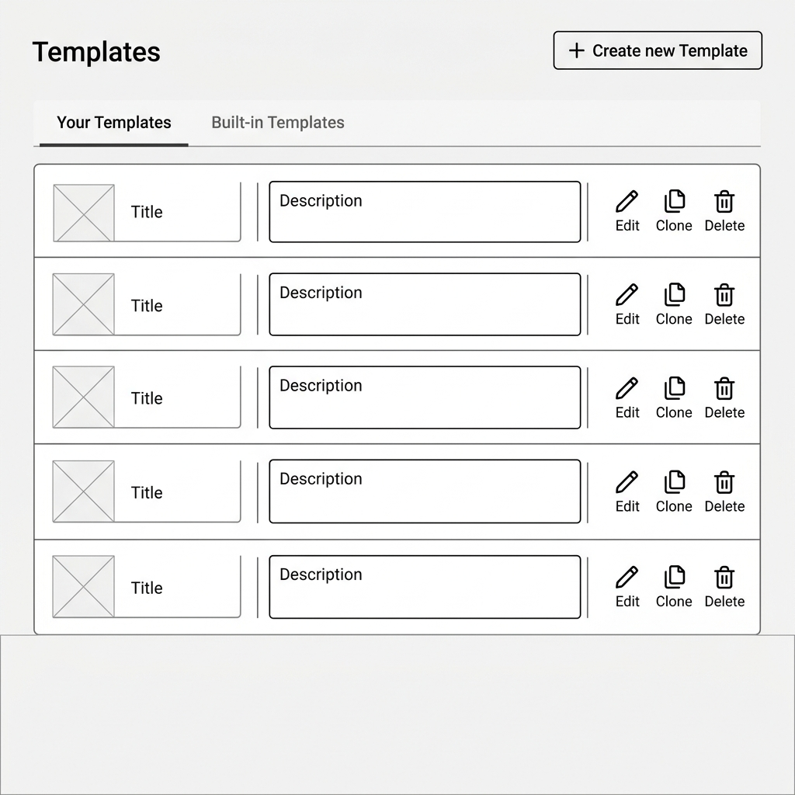

# UI/UX Research & Audit: Zepto Product Personalizer Create New Template Flow

* **Date:** 2026-06-05
* **Target URL:** [https://admin.shopify.com/store/africazones-store/apps/product-personalizer/template](https://admin.shopify.com/store/africazones-store/apps/product-personalizer/template)
* **Focus Area:** Create New Template Flow (Naming modal, creation transition, Customizer workspace setup, Basic Settings accordion, empty canvas element initialization, and active canvas object interaction).

---

## 0. Visual Reference & Exploration Recording

### Exploration Recording
* [Exploration Recording](assets/zepto-product-personalizer_create-new-template/recording.webm)
*(Note: An interactive screen recording of the browser exploration session is saved as `recording.webm` inside the assets directory.)*

### Audited UI States

| Audited UI State | Visual Link |
| :--- | :--- |
| **Empty Naming Modal** |  |
| **Filled Naming Modal** |  |
| **Empty Customizer Workspace** |  |
| **Customizer Workspace with Element** |  |
| **Element Canvas Interaction** |  |

---

## 1. Overview
The **Zepto Product Personalizer Create New Template Flow** acts as the initial onboarding funnel for merchants setting up a reusable design blueprint (Template). Instead of building custom configurations product by product, merchants configure a general design template containing preset background images, dimensions, text inputs, file upload areas, and coordinate layouts. 

The user journey begins with a primary "+ Create new Template" trigger on the dashboard index page, opening a naming overlay. Once naming constraints are satisfied, a full-page modal iframe loads the visual Customizer editor, allowing direct layout customization, setting configurations (dimensions, margins, upcharge pricing rules), and visual element editing on an interactive canvas.

---

## 2. User Persona

### Primary Persona: Marcus, Shopify Shop Owner
* **Goals:**
  * Initialize a standard canvas (e.g. 1000px by 1000px square template) to allow customers to add custom names and custom photo uploads to apparel.
  * Drag and position text options directly on the visual preview canvas to preview where the customer's input will render.
  * Easily toggle settings (e.g. "Live Preview" or "Generate Preview") to understand storefront behavior without reading technical documentation.
* **Pain Points:**
  * High loading latency (blank white overlays) when opening the visual Customizer workspace.
  * Lack of a clear visual grid or snapping behavior, making it difficult to center elements precisely.
  * Unintuitive default dropdown choices (e.g., picking a template thumbnail from a dropdown with raw labels rather than viewing a graphic).

---

## 3. Key Features & Functionalities

### A. Template Naming Modal Dialog
* **Visual & Aesthetic Design:** An overlay modal box rendering fields in a single vertical column. Employs clean white card styling with charcoal button actions in the footer.
* **Trigger & Interaction:** Displayed by clicking the "+ Create new Template" button on the Dashboard. Features immediate focus on the "Template name *" field.
* **Validation & Logic Checks:**
  * "Template name *" is marked with a red asterisk and is strictly required.
  * Submitting empty displays `Template name is required` in red warning text.
  * Dropdown selector for the Thumbnail field defaults to `--Select--` containing text items.

### B. Customizer - Basic Settings Pane
* **Visual & Aesthetic Design:** Collapsible accordion panel in the Left Sidebar. Features clean gray boundaries and clear numeric/text field containers.
* **Trigger & Interaction:** Clicking the accordion header toggles its visible state.
* **Validation & Logic Checks:**
  * **View Name:** Defaults to `Main View`.
  * **View Background:** Defaults to `Blank Canvas`. (Options: *Blank Canvas*, *Uploaded Image*, *Product Image*, *Combined Variant Image*).
  * **Canvas Dimension:** Width (W) and Height (H) inputs accept integers, defaulting to `1000px` by `1000px`. Values are validated and constrained to bounds between `500px` and `5000px`.

### C. Customizer - Cart and Order Settings Pane
* **Visual & Aesthetic Design:** Collapsible sidebar accordion pane displaying toggle switches and dropdown selection menus.
* **Trigger & Interaction:** Expands on click. Toggling options sends instant state changes to the configuration JSON schema.
* **Validation & Logic Checks:**
  * **Generate Preview:** Switch (Default: `checked`).
  * **Preview Size:** Dropdown (Default: `Compressed`).
  * **Additional File:** Switch (Default: `checked`).
  * **Hide Background in order Image:** Switch (Default: `unchecked`).
  * **Custom cart label:** Switch (Default: `unchecked`).

### D. Central Canvas Workspace
* **Visual & Aesthetic Design:** Large gray editor panel visualizing the canvas footprint. Shows a bounding border indicating the current `W` x `H` limits.
* **Trigger & Interaction:**
  * If no customization options exist, an empty-state message (`There are no elements under this view.`) and a prominent "+ Add New Element" button are displayed.
  * Clicking "+ Add New Element" appends an interactive item layer on the canvas, revealing resize handles, rotate buttons, and dragging logic.
* **Validation & Logic Checks:** Canvas elements update coordinates (`x`, `y`) and size bounds in the configuration layer synchronously during drag-and-drop operations.

---

### 3.1 UI Component & Element Inventory

| Component / Element Name | Type (Button, Dropdown, Toggle, Card, Input) | Default State / Value | Layout Placement & Parent Container |
| :--- | :--- | :--- | :--- |
| **+ Create new Template** | Button (Primary) | Active / Visible | Page Header (Top Right) |
| **Template name \*** | Input (Text) | Empty (Required) | Naming Modal Container |
| **Template description** | Textarea | Empty | Naming Modal Container |
| **Thumbnail** | Dropdown | `--Select--` | Naming Modal Container |
| **Create** | Button (Primary) | Active / Visible | Naming Modal Footer (Right) |
| **Cancel** | Button (Secondary) | Active / Visible | Naming Modal Footer (Left) |
| **Basic Settings ** | Accordion Header | Collapsed | Customizer Sidebar (Left Panel) |
| **View Name** | Input (Text) | `Main View` | Left Sidebar -> Basic Settings Accordion |
| **View Background** | Dropdown | `Blank Canvas` | Left Sidebar -> Basic Settings Accordion |
| **Width (W) / Height (H)** | Input (Number/px) | `1000` / `1000` | Left Sidebar -> Basic Settings Accordion |
| **Cart & Order settings **| Accordion Header | Collapsed | Customizer Sidebar (Left Panel) |
| **Generate Preview** | Switch Toggle | Checked (Active) | Left Sidebar -> Cart & Order Settings Accordion |
| **Preview Size** | Dropdown | `Compressed` | Left Sidebar -> Cart & Order Settings Accordion |
| **Additional File** | Switch Toggle | Checked (Active) | Left Sidebar -> Cart & Order Settings Accordion |
| **Hide Background...** | Switch Toggle | Unchecked (Inactive) | Left Sidebar -> Cart & Order Settings Accordion |
| **Custom cart label** | Switch Toggle | Unchecked (Inactive) | Left Sidebar -> Cart & Order Settings Accordion |
| **+ Add New Element** | Button (Secondary) | Active / Visible | Center Canvas (Empty state trigger) |
| **Live Preview** | Switch Toggle | Checked (Active) | Customizer Header Panel (Right) |
| **Template Status** | Badge | `Active` | Customizer Header Panel (Center) |

---

## 4. User Flow & Information Architecture

### Branching User Flow



### Hierarchical Information Architecture Tree

```
Create Template Flow
├─ Template Dashboard Page
│  └─ Primary Header Action: "+ Create new Template"
├─ Naming & Setup Modal Overlay
│  ├─ Form Field: "Template name *" (Input text, validation required)
│  ├─ Form Field: "Template description" (Textarea)
│  ├─ Form Field: "Thumbnail" (Select dropdown)
│  └─ Modal Footer
│     ├─ Action Button: "Cancel" (Closes modal overlay)
│     └─ Action Button: "Create" (Validates and redirects)
└─ Customizer Editor Screen (Modal Iframe Overlay)
   ├─ Customizer Header Area
   │  ├─ Current Template Name Display
   │  ├─ Status Indicator: "Active"
   │  ├─ Switch Toggle: "Live Preview"
   │  └─ Action Button: Save Options ( dropdown)
   ├─ Collapsible Configuration Sidebar (Left Pane)
   │  ├─ Basic Settings Panel
   │  │  ├─ Input: "View Name"
   │  │  ├─ Dropdown: "View Background"
   │  │  └─ Numeric Spinbuttons: Width "W" (px) & Height "H" (px)
   │  └─ Cart and Order settings Panel
   │     ├─ Switch Toggle: "Generate Preview"
   │     ├─ Dropdown: "Preview Size"
   │     ├─ Switch Toggle: "Additional File"
   │     ├─ Switch Toggle: "Hide Background in order Image"
   │     └─ Switch Toggle: "Custom cart label"
   └─ Canvas Designer Workspace (Center & Right Pane)
      ├─ View Selector tab ("Main View")
      ├─ Interactive Canvas Frame
      │  ├─ Canvas bounding box guides
      │  ├─ Interactive element bounding boxes (Resize, Rotate, Drag selectors)
      │  └─ Empty State Message: "There are no elements under this view."
      └─ Action Button: "+ Add New Element"
```

---

## 5. Visual Styling System (Color, Typography, Spacing)

Audited design parameters extracted from the modal overlay and Customizer workspace views:

* **Color Palette:**
  * **Page Background:** `#f6f6f7` (Standard Shopify admin canvas color)
  * **Card & Panel Backgrounds:** `#ffffff` (Modal cards, sidebar settings accordion panels)
  * **Primary Text:** `#212529` / `rgb(33, 37, 41)` (Input labels, headers, selected options)
  * **Secondary Text / Placeholders:** `#6d7175` / `rgb(109, 113, 117)` (Descriptions, blank state hints)
  * **Primary Accent / Action Button:** `#303030` (Charcoal dark gray for Create, Save, Toggles)
  * **Error Warning Text:** `#d32f2f` (Alert red for required validation text)
  * **Canvas Border Grid Outline:** `#e1e3e5` (Faint gray dividing lines)
* **Typography:**
  * **Font Stack:** `-apple-system, BlinkMacSystemFont, "Segoe UI", Roboto, sans-serif`
  * **Modal/Workspace Header Title:** `14px` weight `700` (Bold)
  * **Section Labels & Form Labels:** `13px` weight `600`
  * **Help Subtitles & Descriptions:** `12px` weight `400`
* **Spacing, Corners & Elevation:**
  * **Border Radii:** `8px` for modal frames, `6px` for text field inputs, buttons, and settings drawers.
  * **Paddings:** `20px` inside naming modal margins, `12px` inside accordion drawers, `16px` margin around canvas footprint.
  * **Box Shadows:** `0 2px 8px rgba(0, 0, 0, 0.05)` on panels, `0px 1px 2px rgba(0, 0, 0, 0.06)` elevation separation under customizer control header.

---

## 6. UI/UX Analysis (Core Audit)

### Heuristic Evaluation

1. **Visibility of System Status:**
   * *Pros:* Instantly displays validation messages (`Template name is required`) if the merchant clicks "Create" with an empty name.
   * *Cons:* When transferring from the Naming Modal to the Customizer workspace, the double-nested iframe requires an HMAC verification handshake, resulting in a blank loader/white screen delay (2-3 seconds) with no skeleton screen or progress text.
2. **Match Between System and Real World:**
   * *Pros:* Resizing dimensions immediately changes the width/height of the canvas container, showing a clear outline.
   * *Cons:* The Thumbnail field selector dropdown lists text-based options that aren't visually intuitive, instead of presenting a graphical thumbnail icon grid.
3. **Consistency and Standards:**
   * *Pros:* Form overlays, typography selection, and border parameters match the Shopify Polaris layout style, maintaining consistency.
   * *Cons:* Canvas interactive option boxes use thin dotted borders and custom blue rotate/delete badges that deviate from standard Polaris layouts.
4. **User Control and Freedom:**
   * *Pros:* Cancel buttons are easily accessible on the modal forms, and a large Close button returns the merchant back to the dashboard layout.
   * *Cons:* When an element is added to the canvas, there is no quick "Undo" button or history tracking, meaning mistakes require manually deleting option cards or coordinates.

### Pros
* **Fast Template Naming Step:** Segmenting the naming stage from layout building prevents overwhelming the user.
* **Instant Canvas Scaling:** Modifying width/height parameters immediately scales the workspace dimensions dynamically.
* **Empty State Call-to-Action:** Displays a prominent "+ Add New Element" button directly on the canvas when empty, guiding the merchant on what to do.

### Cons & Friction Points
* **Iframe Transition Latency:** Double-nested iframe load sequence causes high LCP rendering lag during template editor initialization.
* **Drag-and-Drop Guidance Lack:** Added elements drop on the canvas without visual guidelines or tooltips explaining that they can be resized, rotated, or configured via sidebar cards.

---

## 7. Technical UI Design Deliverables

### Low-Fidelity UX Skeleton Wireframe
The wireframe outlines the layout boundaries, settings pane divisions, and central canvas state blocks.



### High-Fidelity Mockup Specification
The mockup redesigns the input fields, visualizes the accordion tabs, and formats action buttons.


#### Redesign Design Tokens
* **Theme Colors:** Polaris Emerald `#008060` (Primary CTA background), Warm Gray background `#f1f2f4`, Canvas frame outline `#babfc3`.
* **Typography:** `Inter, sans-serif` base font.
  * *Headers:* `15px`, weight `700`.
  * *Labels:* `13px`, weight `600`.
  * *Text:* `12px`, weight `400`.
* **Elevations:** Border outline `1px solid #e1e3e5` instead of heavy dropshadows to match Shopify Admin layout structures.
* **Border Radii:** Card wrappers rounded at `8px`, input boxes and action headers rounded at `6px`.

---

## 8. Design Recommendations & Actionable Improvements

| Recommended Action | Impact | Effort | Priority |
| :--- | :--- | :--- | :--- |
| **Iframe Skeleton Loader:** Add a Polaris skeleton placeholder layout (mocking left sidebar and main canvas) inside the modal frame to hide HMAC load delay. | **High** | **Medium** | **High** |
| **Canvas Element Placement Overlay:** Display a dotted alignment grid and a brief "Drag & Resize to place option" tooltip when a new element is added. | **High** | **Low** | **High** |
| **Visual Thumbnail Cards:** Replace the simple dropdown menu for template thumbnails in the creation modal with a horizontal preview card picker. | **Medium** | **Medium** | **Medium** |
| **Canvas Undo/Redo Action:** Add quick history buttons (Undo / Redo icons) in the Customizer top bar to allow merchants to revert layout errors. | **Medium** | **High** | **Low** |

---

## 9. Conclusion
The Zepto Product Personalizer template creation flow provides a fast, structured onboarding pipeline. However, the iframe load latency and the lack of guidance when adding option elements represent significant friction points. Integrating skeleton screen loaders during iframe transition states and adding temporary onboarding guides/grids on the canvas will improve usability and reduce drop-off.

---

## 10. Open Questions / Clarifications

### Clarification Questions
1. **Default Templates:** Would merchants benefit from starting with pre-defined dimension presets (e.g., "Phone Case", "Coffee Mug", "Apparel Engraving") inside the creation modal rather than starting with a blank canvas?
2. **Shopify Media Integration:** Should the background image picker inside Basic Settings integrate directly with the Shopify files API to allow browsing the store's existing asset library?

### Manual Exploration Recommendations
* **Micro-interactions:** Drag and resize canvas elements on mobile or touch-sensitive screens to inspect coordinate response boundaries.
* **Out-of-Scope Connected Flows:** Inspect the synchronization flow (`Template Sync`) after saving options to verify how templates linked downstream affect existing catalog variant items.
