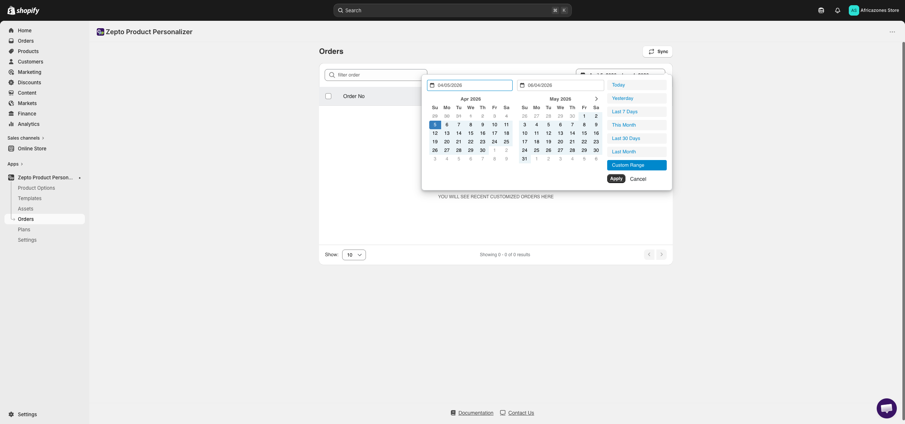
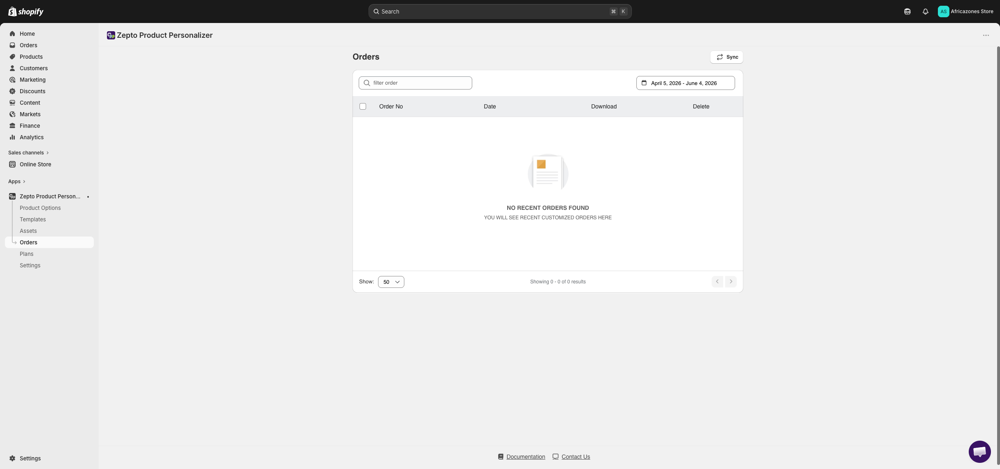
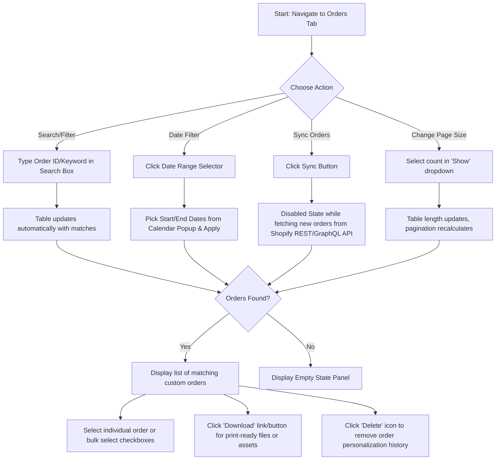
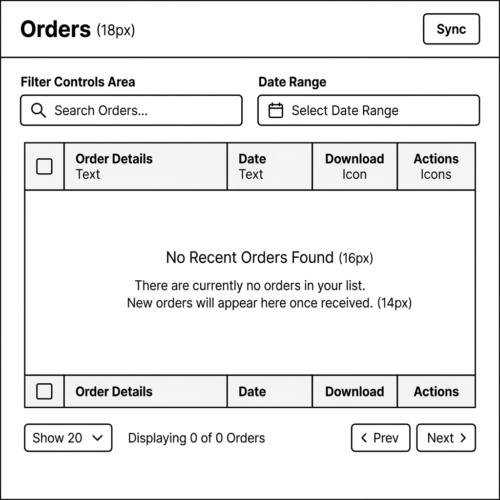
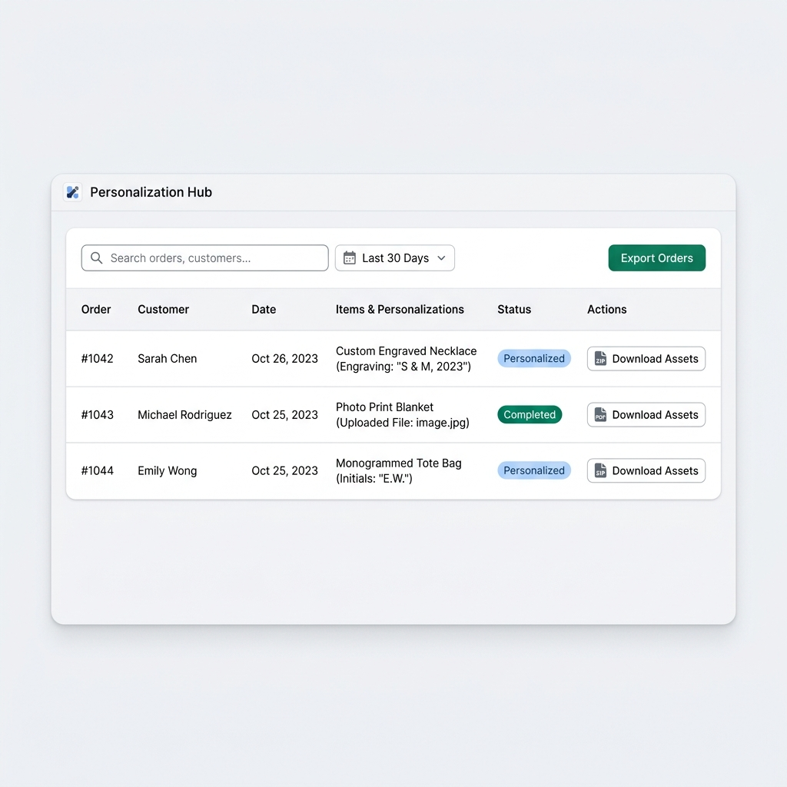

# UI/UX Research & Audit: Zepto Product Personalizer Orders Page

* **Date:** 2026-06-04
* **Target URL:** [https://admin.shopify.com/store/africazones-store/apps/product-personalizer/orders](https://admin.shopify.com/store/africazones-store/apps/product-personalizer/orders)
* **Focus Area:** The Orders tab in Zepto Product Personalizer

---

## 0. Visual Reference & Exploration Recording

### Exploration Recording
* [Exploration Recording](assets/zepto-product-personalizer_orders/recording.webm)
*(Note: A full screen interaction session recording has been generated and saved locally as `recording.webm` in the assets directory.)*

### Audited UI States

| State / Panel | Screenshot Link |
| :--- | :--- |
| **Main Orders Layout** |  |
| **Filters & Search View** |  |
| **Empty State Panel** |  |
| **Actions & Dropdowns** |  |

---

## 1. Overview

The **Orders** page serves as the backend fulfillment dashboard for merchants using the **Zepto Product Personalizer** Shopify application. Its primary utility is to list, search, filter, and access customized print-ready files or personalization data associated with customer purchases. It acts as the bridge between storefront personalization actions and the merchant's physical fulfillment pipeline.

---

## 2. User Persona

### Primary Persona: Marcus, Fulfillment Specialist
* **Role:** Fulfillment specialist and print operator at a custom engraving workshop.
* **Goals:**
  * Quickly locate recently placed personalized orders to extract custom engraving text and uploaded customer image assets.
  * Download print-ready files in bulk or individually for production setup.
  * Sync new Shopify orders manually when expecting a rush order.
* **Pain Points:**
  * Lack of order status indicators (e.g. "Processing", "Printed", "Failed") makes tracking completed designs tedious.
  * Navigating a long table without quick tabbed filters forces constant query typing or date adjusting.
  * default typography and button glyphs sometimes break, adding visual confusion when processing orders quickly.

---

## 3. Key Features & Functionalities

### 1. Header Toolbar
* **Visual & Aesthetic Design:** Left-aligned bold heading title "Orders" (`20px`, dark gray) with a right-aligned secondary Action Button "Sync" (`12px`, white background, inset outline border).
* **Trigger & Interaction:** Clicking the "Sync" button sends a call to pull recent orders from Shopify. The button becomes disabled and displays a syncing state during retrieval.
* **Validation & Logic Checks:** Simple action trigger. Disables itself temporarily to prevent duplicate concurrent network requests.

### 2. Search & Date Filter Bar
* **Visual & Aesthetic Design:** Located directly above the table. It consists of a text search input (with placeholder "filter order") on the left and a date-range dropdown selector showing active start-to-end dates on the right.
* **Trigger & Interaction:** Typing a query and pressing Enter executes a list search. Clicking the date selector expands a calendar layout popover for picking specific date boundaries.
* **Validation & Logic Checks:** Date inputs validate chronological order (start date must precede end date).

### 3. Orders Grid Table
* **Visual & Aesthetic Design:** A layout showing columns for: Selection Checkboxes, Order Numbers, Dates, Download Links, and Delete buttons.
* **Trigger & Interaction:** Hovering rows changes background styling slightly. Clicking column headers sorts the grid. Checkboxes allow bulk selections.
* **Validation & Logic Checks:** Shows a custom empty state box if no records match: "NO RECENT ORDERS FOUND" with subtext "YOU WILL SEE RECENT CUSTOMIZED ORDERS HERE" in centered light gray typography.

### 4. Footer Pagination & Help Panel
* **Visual & Aesthetic Design:** Consists of page-size selector ("Show:" dropdown, default values: 5 to 100), results count label ("Showing 0 - 0 of 0 results"), previous/next chevrons, and bottom links ("Documentation", "Contact Us").
* **Trigger & Interaction:** Changing the Show dropdown refreshes results and recalculates page indicators. Chevron clicks load corresponding result segments.
* **Validation & Logic Checks:** Chevron buttons are disabled when on the first/last page or when result count is zero.

### 3.1 UI Component & Element Inventory

| Component / Element Name | Type (Button, Dropdown, Toggle, Card, Input) | Default State / Value | Layout Placement & Parent Container |
| :--- | :--- | :--- | :--- |
| **Page Title ("Orders")** | Text Label | "Orders" (Heading 6, 20px, Bold) | Top Left, Header Container |
| **"Sync" Button** | Button | Enabled / White background, dark gray text | Top Right, Header Container |
| **"filter order" Box** | Input | Empty / Placeholder text | Left, Filter Toolbar Wrapper |
| **Date Range Selector** | Dropdown Button | Active Date Range (e.g., April 5 - June 4) | Right, Filter Toolbar Wrapper |
| **Main Table Grid** | Table Layout | Column Headers: Checkbox, Order No, Date, Download, Delete | Main Center Container |
| **Empty State Card** | Card Component | Centered Text Alerts (NO RECENT ORDERS...) | Inside Main Table Body (when empty) |
| **"Show:" Dropdown** | Dropdown Selector | Default list length options (5 - 100) | Bottom Left, Footer Controls |
| **Results Count** | Text Label | "Showing 0 - 0 of 0 results" | Bottom Left-Center, Footer Controls |
| **Prev/Next Chevrons** | Button Icons | Disabled (Font glyphs: `` and ``) | Bottom Right-Center, Footer Controls |
| **Support Links** | Hyperlinks | "Documentation" and "Contact Us" | Bottom Right, Footer Controls |
| **Live Chat ("Open chat")** | Floating Button | Soft blue background, chat bubble icon | Bottom Right Corner, Screen Overlay |

---

## 4. User Flow & Information Architecture

### Branching User Flow



### Hierarchical Information Architecture Tree

```
Zepto Orders Root
├─ Shopify Admin Header
└─ Zepto Cross-Origin Iframe Container (cdn-zeptoapps.com/orders)
   ├─ Page Header
   │  ├─ Title ("Orders")
   │  └─ Primary Button ("Sync")
   ├─ Filters & Search Toolbelt
   │  ├─ Search Textbox ("filter order")
   │  └─ Date Picker Dropdown ("Select Date Range")
   ├─ Main Orders Data Table
   │  ├─ Column Headers (Checkbox, Order No, Date, Download, Delete)
   │  ├─ Empty State Card Container (if no orders)
   │  │  ├─ Heading ("NO RECENT ORDERS FOUND")
   │  │  └─ Paragraph ("YOU WILL SEE RECENT CUSTOMIZED ORDERS HERE")
   │  └─ Order Rows (if orders present)
   │     ├─ Selection Checkbox
   │     ├─ Order Number Link
   │     ├─ Creation Date Timestamp
   │     ├─ Download Assets Link/Buttons (PDF, ZIP, original images)
   │     └─ Delete Order Action Button
   └─ Page Footer Control Area
      ├─ Left-side Page Size Dropdown ("Show: [X]")
      ├─ Center-left Record Indicator ("Showing X - Y of Z results")
      ├─ Center-right Pagination Chevron Buttons (Prev/Next)
      ├─ Right-side Help Links (Documentation, Contact Us)
      └─ Floating Widget ("Open chat" bottom right)
```

---

## 5. Visual Styling System (Color, Typography, Spacing)

* **Color Palette:**
  * **Backgrounds:** Page background `rgb(246, 246, 247)` (off-white cool gray). Table content card `rgb(255, 255, 255)` (pure white).
  * **Text Colors:** Primary title `rgb(48, 48, 48)` (dark grey / `#303030`). Empty state description `rgb(109, 113, 117)` (neutral grey). Page links `rgb(0, 91, 211)` (standard link blue).
  * **Accent/Action Colors:** Button font `rgb(48, 48, 48)`. Selection indicators and focus states use classic blue highlights. Hover state background on buttons is a soft gray `rgb(241, 241, 241)`.
  * **Border & Divider Colors:** Cool border gray `rgb(209, 213, 219)` or `#D1D5DB`.
* **Typography:**
  * **Font Families:** System default `sans-serif` stack.
  * **Font Sizes & Weights:**
    * Page Title: `20px` / `700` (Bold)
    * Empty State Heading: `16px` / `600` (Semibold)
    * Table Header & Body: `13px` or `14px` / `400` (Regular)
    * Buttons & Action labels: `12px` / `550` (Medium)
  * **Line Heights:** Approximately `1.4` to `1.5` on body text; `1.2` on headers.
* **Spacing & Corner Styles:**
  * **Container Padding:** Table cells use `12px` padding. The search bar has padding of `6px 12px`.
  * **Border Radii:** Outer container cards, inputs, and action buttons use `8px` rounded corners.
  * **Box Shadows:** The Sync button uses standard Polaris-inspired shadows: `rgb(181, 181, 181) 0px -1px 0px 0px inset, rgba(0, 0, 0, 0.1) 0px 0px 0px 1px inset, rgb(255, 255, 255) 0px 0.5px 0px 1.5px inset`.

---

## 6. UI/UX Analysis (Core Audit)

### Heuristic Evaluation

1. **Visibility of System Status:** Satisfactory. The empty state graphic makes it clear there are no records. Manually clicking "Sync" triggers a temporary disabled status on the button to prevent double-clicks. However, the data loading state could benefit from skeleton loaders instead of an empty screen shift.
2. **Match Between System and Real World:** High. Standard ecommerce concepts such as "Order No", "Date", "Download", and "Delete" make the page intuitive for store fulfillment operators.
3. **User Control and Freedom:** Adequate. Checkboxes allow bulk selections, and users can manually refresh data using the "Sync" action.
4. **Consistency and Standards:** Moderate. The toolbar button ("Sync") mimics Shopify Polaris patterns, but the layout's typography (basic browser sans-serif stack), default browser select menus, and icons diverge from modern Polaris layout standards, creating subtle visual discord.
5. **Flexibility and Efficiency of Use:** Low. The page lacks critical sorting tools, bulk asset download options, and quick-filter tabs.

### Pros
* **Clean layout:** Spacing around the empty state card makes it highly legible.
* **Responsive components:** Dropdowns, input fields, and search boxes react quickly.
* **Shopify App Bridge integration:** Top navigation and save banners hook correctly.

### Cons & Friction Points
* **No Quick-Filter Tabs:** Merchants must manually type search strings or adjust calendar ranges. Quick tabs (e.g. "All", "Ready for Print", "Unfulfilled") are missing.
* **No Bulk Asset Download:** If ten orders have custom engraving images, the fulfillment operator must click download ten times.
* **Inconsistent Icon Fonts:** Arrow icons are loaded as raw font glyphs (``, ``), which are prone to rendering errors (showing blank squares) if custom fonts fail to load.
* **Minimal Order Status Info:** The table only shows basic order details. Crucial fulfillment info (Shopify fulfillment status, fulfillment location) is missing.

---

## 7. Technical UI Design Deliverables

### Low-Fidelity UX Skeleton Wireframe



*The low-fidelity wireframe illustrates a unified, Polaris-aligned structure, standardizing filters, search wrappers, empty states, and pagination blocks to reduce visual noise.*

### High-Fidelity Mockup Specification



*The high-fidelity mockup introduces a modern Polaris-compliant interface with clean typography, clear row items, status badges (e.g. 'Personalized', 'Completed'), and explicit icon actions for downloading personalized print assets.*

### Visual Redesign Design Tokens
* **Font Family:** `Inter, -apple-system, BlinkMacSystemFont, "Segoe UI", Roboto, Helvetica, Arial, sans-serif`
* **Brand Accent:** Polaris Primary Green `#008060` (used for primary actions/confirmations).
* **Fulfillment Status Badges:**
  * **Personalized:** Background `#E0F2FE` (Light blue) / Text `#0369A1` (Dark blue).
  * **Completed:** Background `#DCFCE7` (Light green) / Text `#15803D` (Dark green).
  * **Pending:** Background `#FEF3C7` (Light amber) / Text `#B45309` (Dark amber).
* **Border styles:** `#E1E3E5` solid border (`1px`) with `8px` rounded corners.
* **Row Spacing:** Padding `12px 16px` for optimal vertical scannability.

### Container Layout & Dimension Constraints
* **Page Wrapper:** Standard Polaris `Page` container layout with a maximum width of `1200px` (or fluid with `24px` gutter padding).
* **Table Wrapper:** Uses `overflow-x: auto` to prevent horizontal layout breakage on tablets.
* **Sticky Actions Bar:** If bulk orders are selected, an App Bridge sticky action bar should slide up at the bottom for quick processing (e.g. "Bulk Download Assets", "Bulk Archive").

---

## 8. Design Recommendations & Actionable Improvements

| Recommended Action | Impact | Effort | Priority |
| :--- | :--- | :--- | :--- |
| **Polaris Component Migration:** Replace basic grid table and input boxes with native Polaris `<IndexTable>`, `<TextField>`, and `<Filters>` to maintain platform consistency. | **High** | **Medium** | **High** |
| **Bulk Download Action:** Implement a bulk asset downloader that packs all personalized images/PDFs of selected orders into a single ZIP archive. | **High** | **High** | **High** |
| **Quick Filter Tabs:** Introduce filter tabs (All, Unfulfilled, Personalized, Archived) at the top of the table for quick sorting. | **High** | **Medium** | **High** |
| **Fulfillment Status Column:** Sync and display the order's fulfillment state (e.g., Unfulfilled, Fulfilled) directly from Shopify to avoid merchant tab-switching. | **Medium** | **Medium** | **Medium** |
| **SVG Icon Integration:** Replace font character glyphs for pagination and download controls with vector SVG elements to ensure cross-platform compatibility. | **High** | **Low** | **Medium** |

---

## 9. Conclusion

The **Zepto Product Personalizer Orders** page successfully handles the basic task of listing customized purchases, but lacks the UX optimization needed for high-volume store operations. Transitioning to native Shopify Polaris table components, adding fulfillment status badges, introducing quick filter tabs, and supporting bulk ZIP downloads will drastically improve merchant workflow efficiency and modernize the post-purchase experience.

---

## 10. Open Questions / Clarifications (Optional)

1. **ZIP Asset Compilation:** Does the server compile personalizations on the fly, or are print-ready files pre-generated and stored in an S3 bucket? (Impacts the complexity of the Bulk Download feature).
2. **Shopify API Permissions:** Can the app query the store's core fulfillment status via Webhooks, or is it restricted strictly to personalization metadata?

### Manual Exploration Recommendations
* **Sync Button Validation:** Trigger the manual "Sync" button and observe the visual loading state. Check how long it remains disabled and whether any toast notification appears upon completion.
* **Pagination Glyphs:** Inspect the pagination chevrons (``, ``) on older operating systems (e.g. Windows 7/8 or older macOS versions) to confirm they render correctly as arrows and not fallback squares.
* **Bulk Checkbox Actions:** Check if checking the main header checkbox activates a multi-select state or highlights rows, inspecting hover and selection outlines.
