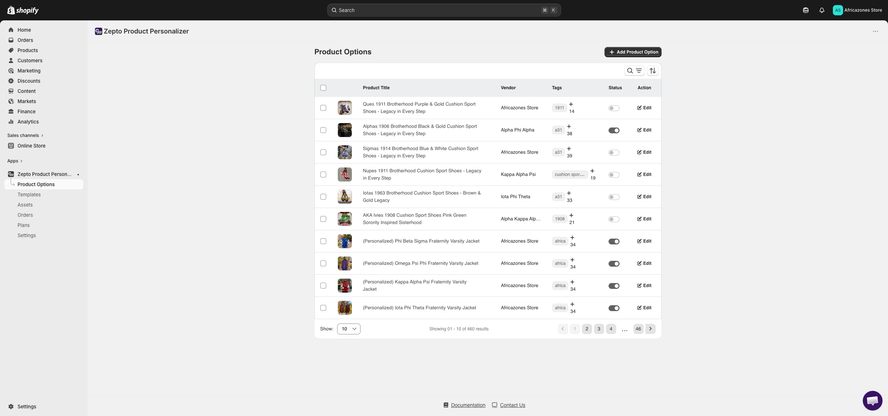
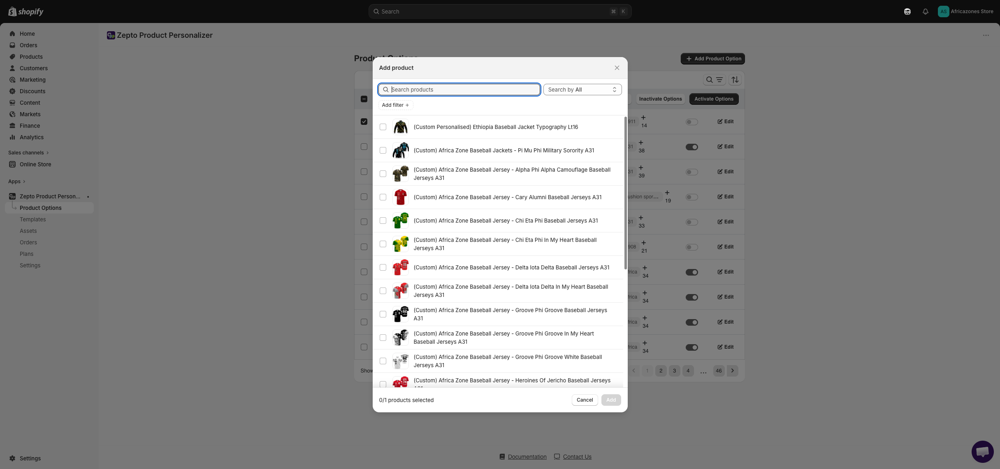
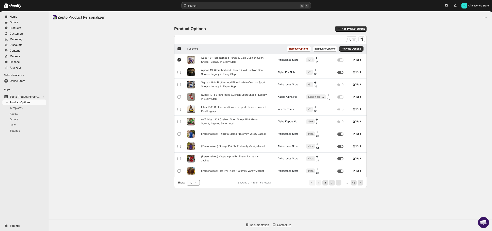
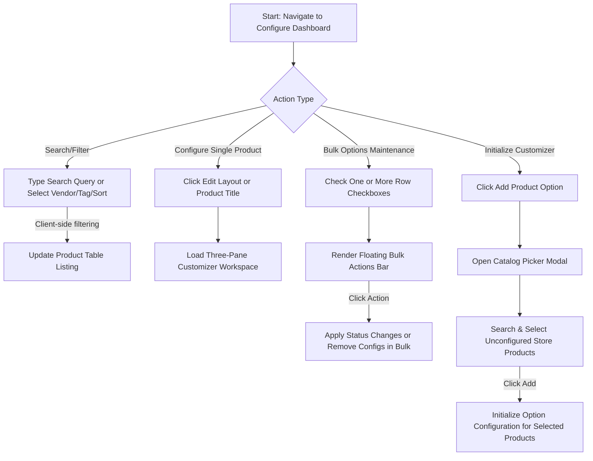
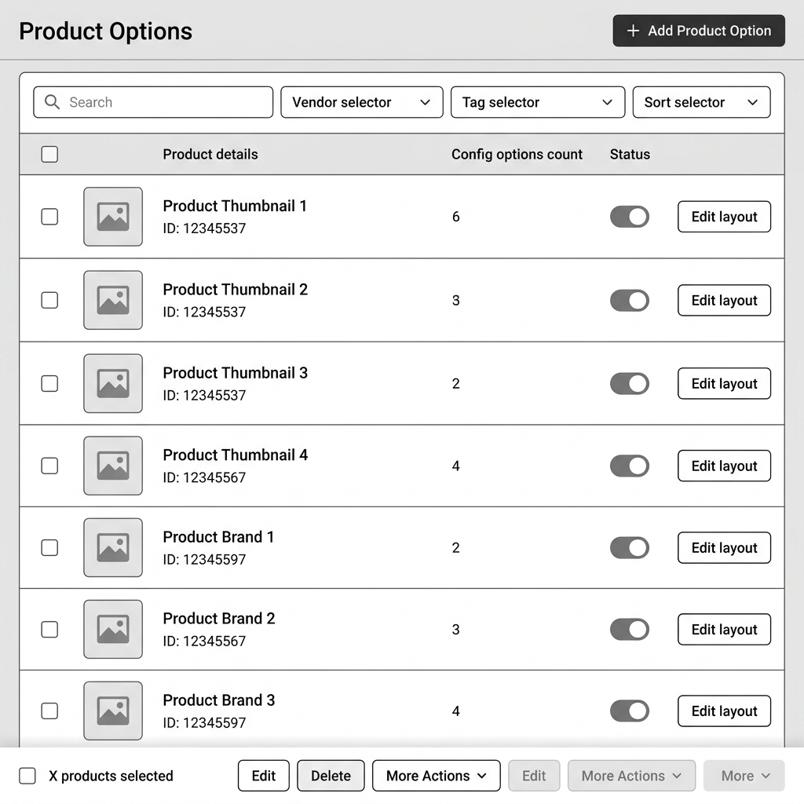
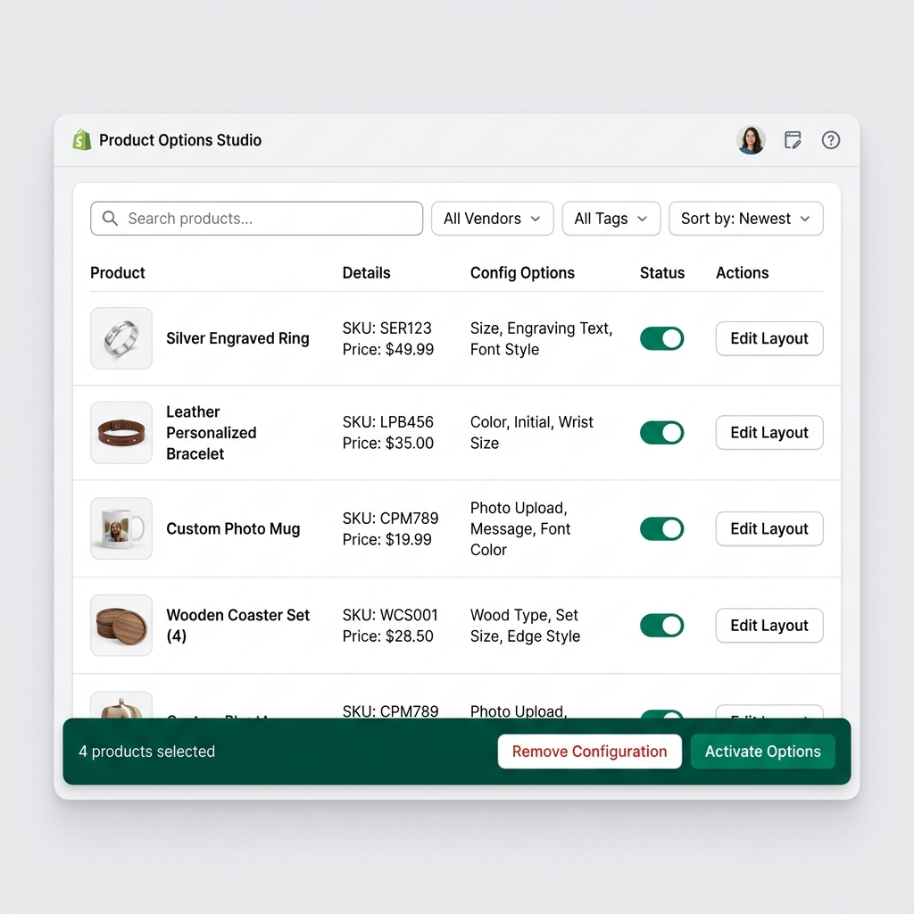

# UI/UX Research & Audit: Zepto Product Personalizer Options Dashboard

* **Date:** 2026-06-04
* **Target URL:** [https://admin.shopify.com/store/africazones-store/apps/product-personalizer/configure](https://admin.shopify.com/store/africazones-store/apps/product-personalizer/configure)
* **Focus Area:** Product Options Tab - Dashboard UI (Product catalog listing, searching/filtering, bulk options configuration controls, and catalog selector modal).

---

## 0. Visual Reference & Exploration Recording

### Exploration Recording
* [Exploration Recording](assets/zepto-product-personalizer_product-options-dashboard/recording.webm)
*(Note: An interactive screen recording of the browser exploration session is saved as `recording.webm` inside the assets directory.)*

### Audited UI States

| Audited UI State | Visual Link |
| :--- | :--- |
| **Main Dashboard Listing** |  |
| **Bulk Actions Floating Bar** |  |
| **Catalog Picker Modal** |  |
| **Row Actions Dropdown Menu** |  |

---

## 1. Overview
The **Zepto Product Personalizer Options Dashboard** serves as the central directory and index for merchants. It lists the products in the store's catalog, detailing which products have customizer options configured, how many customization layers are active, and their publication status ("Active" vs. "Draft"). From this central directory, merchants can toggle options visibility, perform bulk configuration changes (activation, inactivation, or configuration removal), duplicate options across products, export setup schemas as JSON files, and trigger the Catalog Picker Modal to create new personalization profiles.

---

## 2. User Persona

### Primary Persona: Elena, Custom Product Designer
* **Goals:** 
  * Easily find specific products in a large inventory (e.g., custom mugs, engraved jewelry, monogrammed pillows) using searches, vendor categorizations, or product tags.
  * Quickly configure personalization layout templates and clone existing option settings to newly imported store variants.
  * Perform bulk maintenance tasks on multiple items simultaneously without having to configure each item row-by-row.
* **Pain Points:**
  * Outdated visual elements (such as default Bootstrap toggle switches and custom action triggers) that stand out against Shopify Admin's design language.
  * Incomplete bulk options (e.g., inability to duplicate configurations in bulk, or unclear outcomes of bulk actions).
  * High cognitive fatigue when scrolling through dense tabular structures that lack prominent visual hierarchies, accent badges, or state indicators.

---

## 3. Key Features & Functionalities

### A. Product Catalog Listing Table
* **Visual & Aesthetic Design:** A structured tabular data grid listing products in rows. Each row contains checkbox controllers, featured thumbnail images, titles, ID subtitles, configured layers count (as pill badges), and status toggles.
* **Trigger & Interaction:** Click-based navigation. Clicking a product title or the "🔧 Edit Layout" button loads the customizer editor canvas. Hovering over a row adds a light gray background color to emphasize selection boundaries.
* **Validation & Logic Checks:** Product images fallback to a cardboard box icon (`📦`) if no featured thumbnail exists. Option count pills change styles depending on whether the product has configurations.

### B. Search & Filters Toolbar
* **Visual & Aesthetic Design:** A card-style header container holding a search bar with a magnifying glass indicator, alongside three filter selectors (Vendor, Tag, and Sort order).
* **Trigger & Interaction:** Text inputs trigger instant client-side filtering. Dropdowns expand on click, and selecting options updates the table content dynamically.
* **Validation & Logic Checks:** Typing input redirects the pagination index back to Page 1 to prevent empty state rendering bugs.

### C. Catalog Picker Modal
* **Visual & Aesthetic Design:** An overlay popover modal with a search field and a scrolling grid containing selectable product variants.
* **Trigger & Interaction:** Clicked "+ Add Product Option" (styled as "+ Set Customizer config") to reveal the modal. Infinite scrolling lists variants, and selecting items updates the checked list counter.
* **Validation & Logic Checks:** Includes a loading state spinner while fetching products. "Add" button remains disabled until at least one product is selected.

### D. Bulk Actions Floating Bar
* **Visual & Aesthetic Design:** A colored strip positioned above the data table that displays the number of selected products and bulk actions.
* **Trigger & Interaction:** Appears when one or more row checkboxes are checked. Features buttons to "Activate", "Inactivate", or "Remove Configuration". A triple dot dropdown expansions menu lists extra actions.
* **Validation & Logic Checks:** Automatically hides when all checkboxes are cleared.

---

### 3.1 UI Component & Element Inventory

| Component / Element Name | Type (Button, Dropdown, Toggle, Card, Input) | Default State / Value | Layout Placement & Parent Container |
| :--- | :--- | :--- | :--- |
| **Add Product Option** | Button | Visible / Active | Top-right corner of Page Header |
| **Search Input** | Input | Empty | Left side of Search & Filters Row |
| **Filter by Vendor** | Dropdown | "Filter by Vendor" | Middle-left of Search & Filters Row |
| **Filter by Tag** | Dropdown | "Filter by Tag" | Middle-right of Search & Filters Row |
| **Sort Options** | Dropdown | "Sort by: Newest" | Right side of Search & Filters Row |
| **Row Checkbox** | Input (Checkbox) | Unchecked | Leftmost column of every product row |
| **Status Toggle** | Input (Checkbox/Toggle) | Draft (Disabled) | Status column of product row |
| **Edit Layout** | Button | Visible / Active | Rightmost column of product row |
| **More Row Actions (⋮)** | Button | Visible / Closed | Rightmost column next to Edit Layout |
| **Floating Bulk Bar** | Card | Hidden | Spans above table header |
| **Catalog Picker Search** | Input | "Search products" | Header area of Catalog Picker Modal |

---

## 4. User Flow & Information Architecture

### Branching User Flow



### Hierarchical Information Architecture Tree

```
Configure Dashboard Root
├─ Page Header
│  ├─ Title: "Personalizable Products"
│  └─ Primary Button: "+ Set Customizer config"
├─ Floating Bulk Action Toolbar (Active on selection)
│  ├─ Selection Counter
│  ├─ Action Button: "Activate Options"
│  ├─ Action Button: "Inactivate Options"
│  ├─ Action Button: "Remove Configuration"
│  └─ Dropdown Toggle Menu (⋮)
├─ Search & Filtering Card
│  ├─ Search Input ("Search customizer catalog...")
│  ├─ Vendor Select Filter
│  ├─ Tag Select Filter
│  └─ Sort Order Select Dropdown
├─ Product List Data Grid Table
│  ├─ Table Head (Select-All Checkbox, Image, Product details, Config Options, Status, Actions)
│  └─ Table Body (Rows listing product metrics)
│     ├─ Thumbnail Image
│     ├─ Title & ID text
│     ├─ Layer Counter pill badge
│     ├─ Active Status Slider toggle
│     └─ Actions Container (Edit Layout Button, Dropdown cog Menu)
└─ Catalog Picker Modal Overlay (Active on "+ Set Customizer config" click)
   ├─ Modal Header ("Select Products")
   ├─ Filter Sub-Toolbar (Search box, Filter selectors, Add filter button)
   ├─ Catalog Scroll Grid (Checkbox, product title, thumbnail, SKU, ID, active flags)
   └─ Modal Footer (Selected Counter, Cancel button, Add button)
```

---

## 5. Visual Styling System (Color, Typography, Spacing)

Audited design parameters extracted from the dashboard layout:

* **Color Palette:**
  * **Page Background:** `#f6f6f7` (Standard Shopify neutral background)
  * **Container Backgrounds:** `#ffffff` (Cards, Table, and Modal panels)
  * **Primary Text Color:** `#202223` (Labels, product titles, headers)
  * **Secondary Text Color:** `#6d7175` (Subtitles, helper hints, vendor tags)
  * **Accent/CTA Button Background:** `#008060` (Shopify brand emerald green)
  * **Bulk Floating Bar Background:** `#f0fbf7` with active emerald green outline (`#008060`)
  * **Status Toggle Active Background:** `#10b981` (Bright emerald green)
  * **Status Toggle Inactive Background:** `#e4e4e7` (Cool light gray)
* **Typography:**
  * **Font Stack:** `-apple-system, BlinkMacSystemFont, "Segoe UI", Roboto, sans-serif`
  * **Headers:** `20px` weight `700` (Bold)
  * **Labels/Product Titles:** `14px` weight `600`
  * **Body Text/Subtitles:** `12px` - `13px` weight `400`
* **Spacing, Corners & Elevation:**
  * **Border Radii:** `8px` for cards/modal containers, `6px` for inputs/buttons, `12px` for pill tag badges.
  * **Paddings:** `24px` page gutter, `12px` filter bar padding, `14px` table row cell padding.
  * **Box Shadows:** `0 1px 3px rgba(0,0,0,0.08)` on primary containers, `0 4px 12px rgba(0,0,0,0.1)` on dropdown elements.

---

## 6. UI/UX Analysis (Core Audit)

### Heuristic Evaluation

1. **Visibility of System Status:**
   * *Pros:* Instantly displays configuration metadata (e.g. "14 Layers", "Draft" status) for each product row. Saving changes shows immediate status toasts.
   * *Cons:* Transitioning status toggle switches shows a subtle loading overlay spinner, but the overlay is very small and doesn't clearly lock the row, which can lead to accidental double clicks during slow network calls.
2. **Match Between System and Real World:**
   * *Pros:* Product titles and thumbnails map directly to the store's physical catalog.
   * *Cons:* The "+" button labeled "Set Customizer config" is unclear; it should read "+ Add Customizable Product" to align with merchant terminology.
3. **Consistency and Standards:**
   * *Pros:* The dashboard uses a clean layout aligned with modern Shopify App Bridge styles.
   * *Cons:* Toggles are custom elements that do not match Shopify Polaris's standard toggles/switches, causing visual fragmentation. Row buttons mix custom styles with Polaris borders.
4. **User Control and Freedom:**
   * *Pros:* Multiple filter dropdowns can be cleared individually. Bulk select features allow quick resets of row selections.
   * *Cons:* Clicking the dropdown actions menu (⋮) opens options over adjacent elements, but clicking outside the dropdown does not always dismiss it reliably.

### Pros
* **Fast Catalog Filtering:** Multiple filters work together to quickly narrow down catalog listings.
* **Bulk Operations Support:** Allows quick activation, inactivation, or deletion of multiple customized product files.
* **Clean Card Layouts:** The UI elements are organized into separate cards, making the workspace feel spacious.

### Cons & Friction Points
* **Unclear Empty State:** If filters return no results, the table shows a simple text fallback without clear instructions on how to clear filters or add products.
* **Action Dropdown Clutter:** Clicking "⋮" on a row opens a dropdown that overlaps other table rows, causing visual clutter.

---

## 7. Technical UI Design Deliverables

### Low-Fidelity UX Skeleton Wireframe
The wireframe outlines the layout grid and component structures, prioritizing alignment, container padding boundaries, and layout spacing.



### High-Fidelity Mockup Specification
The mockup skins the layout with modern design tokens, adopting a unified Shopify Polaris aesthetic.



#### Recommended Design Tokens
* **Accent Colors:** Primary Emerald `#008060` (Action buttons), Secondary neutral outline `#babfc3` (Dropdowns).
* **Typography:** `Inter, sans-serif` font family.
  * *Titles:* `20px`, weight `700`.
  * *Table Labels:* `14px`, weight `600`.
  * *Meta Subtext:* `12px`, weight `400`.
* **Elevations:** Border outlines (`1px solid #ebebeb`) rather than heavy drop shadows to match Polaris interfaces.
* **Corner Roundness:** Cards rounded at `8px`, buttons and search bars rounded at `6px`.

---

## 8. Design Recommendations & Actionable Improvements

| Recommended Action | Impact | Effort | Priority |
| :--- | :--- | :--- | :--- |
| **Polaris Switch Migration:** Replace the custom status toggle switches with native Shopify Polaris switch elements to match the Shopify admin interface. | **High** | **Low** | **High** |
| **Interactive Empty State:** Redesign empty search results to include a "Clear all filters" button to help users recover from zero-result queries. | **Medium** | **Low** | **High** |
| **Row Action Dropdown Popover:** Upgrade the dropdown menu (⋮) to use a robust Polaris `Popover` component to resolve positioning and dismissal bugs. | **High** | **Medium** | **Medium** |
| **Clarified Call to Action (CTA):** Rename "+ Set Customizer config" to "+ Add Customizable Product" to make the primary action clear to merchants. | **Medium** | **Low** | **Low** |

---

## 9. Conclusion
The Zepto Product Personalizer Options Dashboard provides a solid layout for managing customizable products. However, its visual consistency, status indicators, and terminology can be improved. Transitioning custom toggles to standard Polaris switches and adding clear empty states will improve usability, make catalog management easier, and align the dashboard with modern Shopify admin conventions.

---

## 10. Open Questions / Clarifications

### Clarification Questions
1. **Catalog Volume Scaling:** Should we add a bulk search option (e.g., searching by a comma-separated list of product handles) to help merchants with thousands of products?
2. **Catalog Sync Indicators:** Should we add a manual "Sync Shopify Products" button to the header to let merchants force-refresh their catalog updates?

### Manual Exploration Recommendations
* **Micro-interactions:** Test the status toggle switches to ensure the loading indicator spinner handles slow network responses without layout shifts.
* **Out-of-Scope Connected Flows:** Inspect the Customizer Editor modal itself after clicking "🔧 Edit Layout" to evaluate how options are configured and saved.
