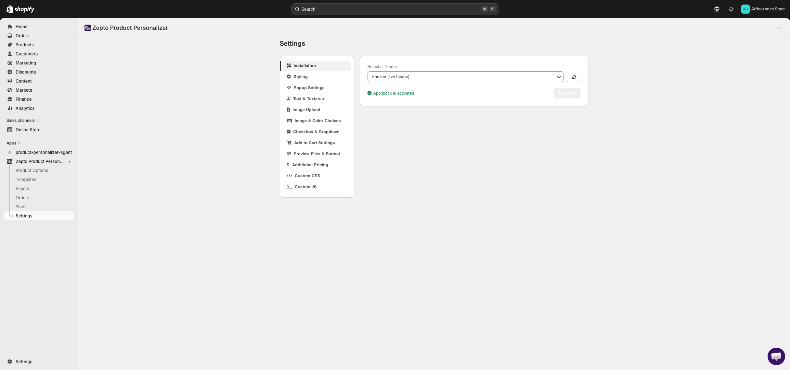
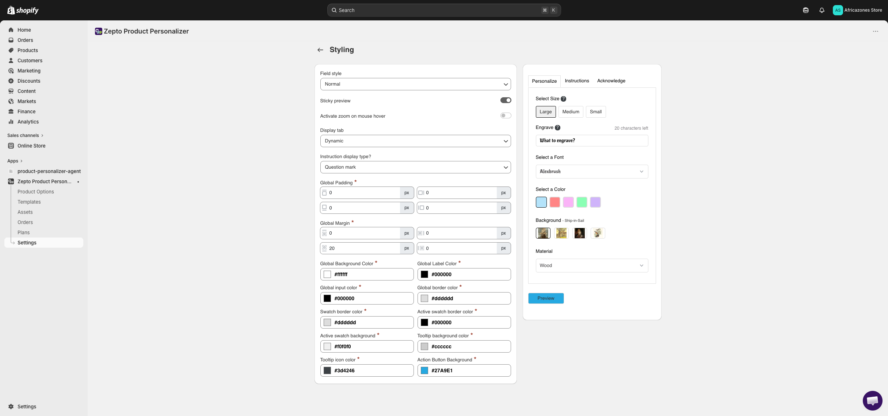
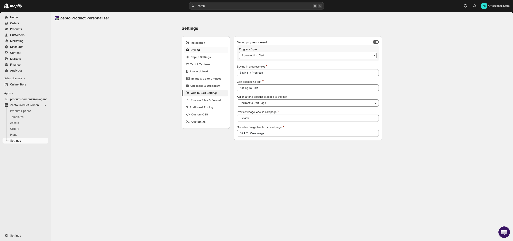
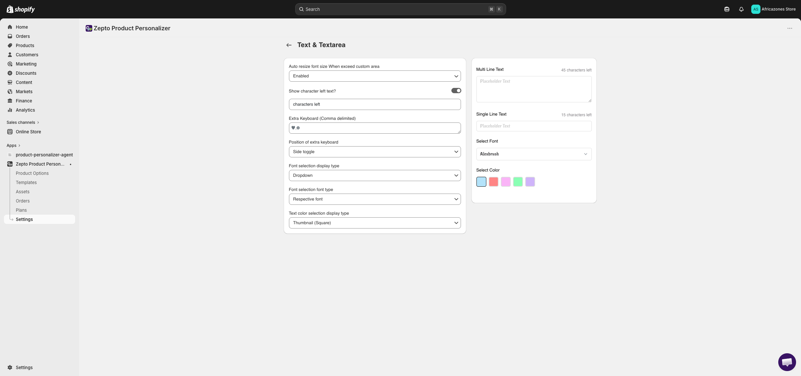
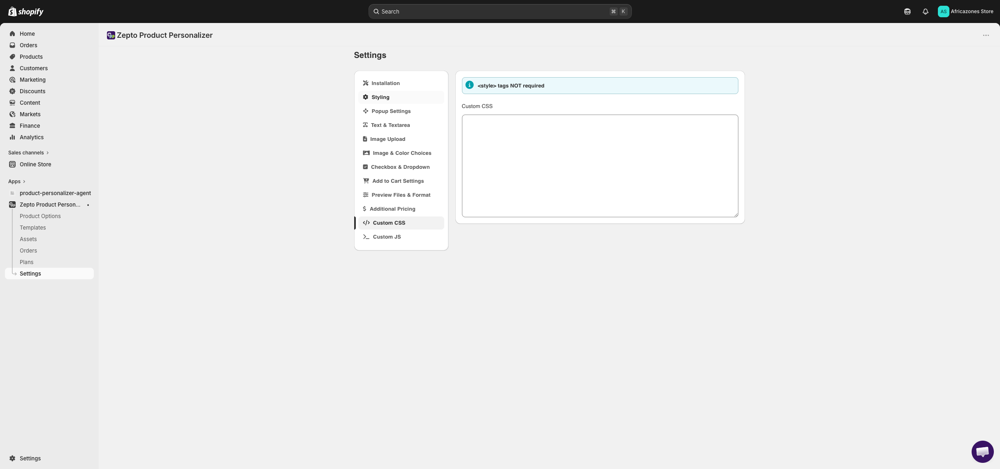
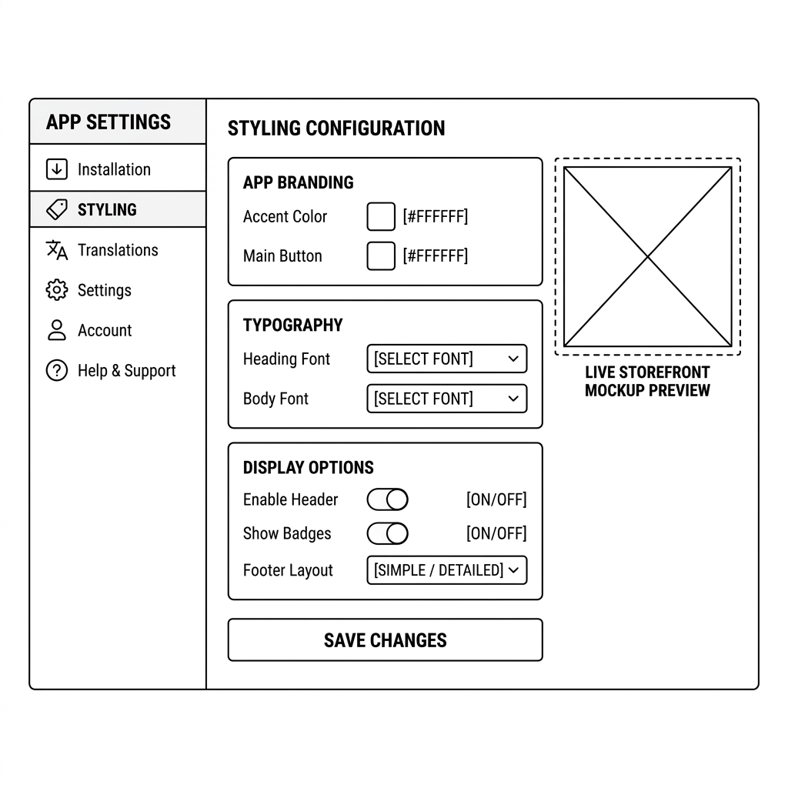
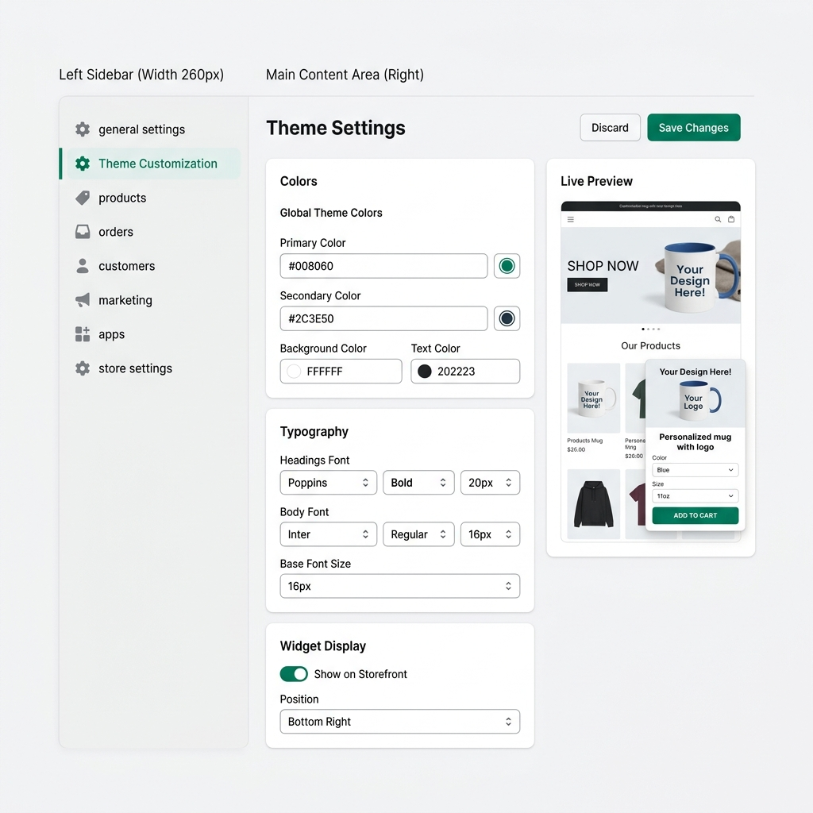

# UI/UX Research & Audit: Zepto Product Personalizer Settings Page (Sidebar & Content Area)

* **Date:** 2026-06-06
* **Target URL:** [https://admin.shopify.com/store/africazones-store/apps/product-personalizer/settings](https://admin.shopify.com/store/africazones-store/apps/product-personalizer/settings)
* **Focus Area:** Sidebar and Content Area Layout & Interactions

---

## 0. Visual Reference & Exploration Recording

### Exploration Recording
* [Exploration Recording](assets/zepto-product-personalizer_settings/recording.webm)
*(Note: A full screen interaction session recording has been generated and saved locally as `recording.webm` in the assets directory.)*

### Audited UI States

| Category Panel | Screenshot Link |
| :--- | :--- |
| **Main Settings Layout** |  |
| **Global Styling & Mockup Preview** |  |
| **Add to Cart & General Settings** |  |
| **Translation & Text Limits** |  |
| **Custom CSS Override Editor** |  |

---

## 1. Overview

The **Settings** page is the configuration hub for merchant-facing customization styles, translation strings, validation constraints, and code integrations within the **Zepto Product Personalizer** Shopify application. Its primary utility is to empower merchants to align the storefront personalization widget with their store brand, manage user inputs, define pricing formats, and configure custom CSS/JS styling rules.

This audit focuses specifically on the **left sidebar category navigation** and the **main content panels**, evaluating how they display configuration fields, how they interact, and how well they comply with modern design standards.

---

## 2. User Persona

### Primary Persona: Sarah, Store Administrator
* **Role:** Store administrator and Web designer for a premium custom jewelry storefront.
* **Goals:** 
  * Align the personalization form widget (input fields, text labels, borders, and buttons) with the brand color palette.
  * Define localized translations for the customization instructions and button actions.
  * Restrict character counts and upload file resolutions to prevent production/engraving errors.
* **Pain Points:**
  * Navigating back and forth between disconnected styling inputs and storefront pages to verify changes.
  * The disjointed visual interface inside the settings pane that breaks away from Shopify Polaris conventions.
  * Complex margin and padding settings configured in pixel inputs without interactive layout helpers.

---

## 3. Key Features & Functionalities

### 1. Left Sidebar Category Menu
* **Visual & Aesthetic Design:** A vertical navigation list on the left side of the iframe listing settings categories (Installation, Styling, Popup Settings, Text & Textarea, etc.). It has a width of `209px` and uses dark slate grey semi-bold typography (`13px` sans-serif, font-weight `550`).
* **Trigger & Interaction:** Click-based navigation. Clicking any item loads the corresponding settings panel dynamically in the main content container. Interactive hover states transition normal list items to 2% opacity black (`rgba(0, 0, 0, 0.02)`).
* **Validation & Logic Checks:** Active item selection highlights the current row in 5% opacity black (`rgba(0, 0, 0, 0.05)`) with rounded corners (`border-radius: 8px`) and a fixed height of `32px`. No independent scrolling is present.

### 2. Styling Configurator & Live Mockup Preview
* **Visual & Aesthetic Design:** Form groups containing toggle switches, color well boxes next to hex code text inputs, and 4-directional spinbuttons for margins/paddings. On the right, it features an interactive mock storefront mockup.
* **Trigger & Interaction:** Changing any slider/toggle or color input dynamically updates the CSS stylesheet of the mock widget on the right in real time.
* **Validation & Logic Checks:** Border fields validate for numbers. Color textboxes validate for correct hex structures (e.g., #ffffff).

### 3. Translation & Label Customization (Text & Textarea)
* **Visual & Aesthetic Design:** Form fields consisting of default text inputs, checkboxes, and select dropdowns for text settings.
* **Trigger & Interaction:** Changing field settings updates the default values of character count indicators, placeholders, and error messages for custom text personalizations.
* **Validation & Logic Checks:** Restricts inputs to valid text strings and numbers.

### 4. Custom CSS Editor
* **Visual & Aesthetic Design:** A multi-line textarea with a monospace font.
* **Trigger & Interaction:** Allows merchants to write direct CSS stylesheet overrides targeting storefront elements.
* **Validation & Logic Checks:** Simple textarea input. Does not perform real-time syntactical validation on custom CSS stylesheets.

### 3.1 UI Component & Element Inventory

| Component / Element Name | Type (Button, Dropdown, Toggle, Card, Input) | Default State / Value | Layout Placement & Parent Container |
| :--- | :--- | :--- | :--- |
| **Sidebar Menu Container** | Menu List | 12 Navigation Items | Left column: `ul.nav.settings-sidebar-ul` |
| **Sidebar active item** | Menu Item | Selected Category (`li.content-changer.active`) | Within sidebar menu list |
| **Form Cards** | Card | White card wrapper | Main content: `div.settings_page` |
| **Toggle Switches** | Toggle | Checked or Unchecked | Inside form cards |
| **Text Inputs & Textareas** | Input / Textarea | Default labels, placeholders, or code | Inside form cards |
| **Color Pickers** | Color Box + Text | Hex code + Visual swatch | Inside styling form cards |
| **Paddings & Margins** | Number Spinbutton | Numeric values in pixels | Inside styling cards |
| **Live Mockup Preview** | Mock Viewer | Floating Mug widget layout | Right side of Styling tab workspace |

---

## 4. User Flow & Information Architecture

### Branching User Flow

```mermaid
graph TD
    A[Start: Navigate to Settings] --> B{Select Category}
    B -->|Installation| C[Select Theme / Check Block Status]
    B -->|Styling| D[Modify Colors / Margins / Paddings]
    B -->|Text & Textarea| E[Update Placeholder Labels & Limits]
    B -->|Custom CSS| F[Write Custom CSS stylesheet rules]
    D --> G[Real-Time Storefront Mockup Updates Preview]
    E --> H[Verify Label Layout]
    F --> I[Observe Custom Styles]
    G & H & I --> J[Trigger Shopify Header Save Alert]
    J -->|Click Save| K[Persist Changes to Shopify Store Database]
    J -->|Click Discard| L[Revert Configuration Inputs]
```



### Hierarchical Information Architecture Tree

```
Zepto Settings Root
├─ Shopify Admin Header
│  └─ Sticky Save/Discard Notification Bar (App Bridge Context)
├─ Shopify App Navigation (Product Options, Templates, Settings)
└─ Zepto Cross-Origin Iframe Container (cdn-zeptoapps.com/settings)
   ├─ Left Sidebar Category Panel (width: 209px, overflow-y: visible)
   │  ├─ Installation
   │  ├─ Styling (active content changes)
   │  ├─ Popup Settings
   │  ├─ Text & Textarea
   │  ├─ Image Upload
   │  ├─ Image & Color Choices
   │  ├─ Checkbox & Dropdown
   │  ├─ Add to Cart Settings
   │  ├─ Preview Files & Format
   │  ├─ Additional Pricing
   │  ├─ Custom CSS
   │  └─ Custom JS
   └─ Main Category Content Panel (width: 950px, dynamic)
      ├─ Dynamic Form Groups (Toggles, Inputs, Color Wells)
      └─ Live Storefront Preview Mockup Panel (Floating on the Right under Styling)
```

---

## 5. Visual Styling System (Color, Typography, Spacing)

### Left Sidebar Navigation Styles
* **Layout Structure**: Vertically aligned flexbox (`display: flex`, `flex-direction: column`) with `width: 209px`, `margin: 0px`, and `padding: 0px`. List items (`li.content-changer`) have compact spacing: `margin-bottom: 2px` (`margin: 0px 0px 2px`).
* **Typography**: Font-family is inherited `sans-serif` from the Shopify frame. Font-size is `13px` and font-weight is `550` (semi-bold) in both normal and active states. Colors are set to `rgb(48, 48, 48)` (dark slate grey).
* **Active State styling**: Identified by the `.active` class (`li.content-changer.active`). It switches from a transparent background to a grey background `rgba(0, 0, 0, 0.05)` (5% black opacity) with rounded borders (`border-radius: 8px`) and height `32px`.
* **Hover styling**: Triggers a background color shift to `rgba(0, 0, 0, 0.02)` (2% black opacity).
* **Scroll behavior**: Sidebar menu does not scroll independently (`overflow-y: visible`). Relies entirely on the outer viewport's page scroll.

### Main Content Area Styles
* **Layout Structure**: Renders adjacent to the sidebar menu with a wrapper of `div.settings_page.w-100.h-100` and an active width of `950px`.
* **Forms & Cards**: Utilizes Polaris-style cards (`.Polaris-Card` / `.form-wrapper`) with `margin: 0px 0px 20px` to separate blocks.
* **Text Inputs & Monospace fields**: Standard text inputs and large textareas (`textarea.form-control.w-100`) have a `border-radius: 8px`, `border: 1px solid rgb(138, 138, 138)`, and `padding: 6px`.
* **Color Pickers**: Form rows feature parallel alignment of color swatch inputs (`ColorWell`) and hex text input boxes (e.g., `#ffffff`, `#27A9E1`).
* **Spacing Spinbuttons**: Numerical input fields (`spinbutton` inputs) allow adjusting margins and paddings in pixels.

---

## 6. UI/UX Analysis (Core Audit)

### Heuristic Evaluation

1. **Visibility of System Status:** Highly effective in the Styling panel where color well changes instantly redraw the live preview mockup block. The Shopify App Bridge successfully registers unsaved changes and triggers the top sticky alert banner.
2. **Match Between System and Real World:** Terms like margin, padding, swatch, and custom CSS align with standard web designer vocabulary. The label names are direct and descriptive.
3. **User Control and Freedom:** Discarding changes immediately restores input states.
4. **Consistency and Standards:** The settings layout diverges significantly from the Shopify Polaris design system used by modern Shopify apps. It utilizes Bootstrap-style panels, inputs, and toggle switches inside the cross-origin iframe, creating visual friction.
5. **Flexibility and Efficiency of Use:** The inclusion of custom CSS and JS textareas allows power users to implement advanced integrations, but there are no default pre-built themes or shortcuts.

### Pros
* **Instant visual feedback loop** in the Styling category via the storefront mockup preview block.
* **Granular styling tokens** (swatch border, tooltip colors, active states) provide precise control over storefront branding.
* **Unified Save mechanism** leverages Shopify App Bridge banners seamlessly.

### Cons & Friction Points
* **Visually outdated UI components** that break Shopify Admin standards.
* **Margin and Padding configuration is confusing** as it uses four separate number inputs without visual padding/margin boxes or diagram helpers.
* **No CSS syntax highlighting or auto-completion** in the Custom CSS textarea editor, increasing the risk of broken storefront styling.
* **Navigation feels disjointed** due to loading views via a cross-origin iframe, resulting in slight delay and layout shifts.

---

## 7. Technical UI Design Deliverables

### Low-Fidelity UX Skeleton Wireframe



*The wireframe proposes a clean layout utilizing a Shopify Polaris layout framework. It establishes a clear visual hierarchy with left sidebar navigation, centralized form controls with categorized card components, and a dedicated storefront preview viewport on the right.*

### High-Fidelity Mockup Specification



*The mockup skins the wireframe using cohesive Polaris design tokens, including modern switch layouts, rounded border panels, subtle container card drop shadows, clean typography, and a polished live preview component with a mock customizer mockup.*

### Visual Redesign Design Tokens
* **Primary Branding Green:** `#008060` (Shopify Green) for active sidebar indicators, primary toggle fills, and primary CTA buttons.
* **Secondary Cool Navy:** `#2C3E50` for secondary action items or text headings.
* **Background Neutrals:** `#F6F6F7` for sidebar background, `#FFFFFF` for main layout cards.
* **Typography:** `Inter` or `SF Pro Display` sans-serif, using `14px` regular for body text, `13px` semi-bold for sidebar links, and `16px` semi-bold for section header titles.
* **Borders & Radii:** `border-radius: 8px` on input text boxes and custom containers; soft shadows (`box-shadow: 0px 1px 3px rgba(0, 0, 0, 0.05)`).

### Container Layout & Dimension Constraints
* **Left Sidebar Width:** Fixed at `260px` to match Polaris standards, with `border-right: 1px solid #E1E3E5`.
* **Right Content Area Width:** Flexible container wrapping between `640px` and `960px`.
* **Mockup Preview Card Width:** Fixed at `340px` floating next to the form container.
* **Responsive Breakpoints:** Above `1200px`, content and mockup display side-by-side. Below `1200px`, mockup stacks below the settings forms.

---

## 8. Design Recommendations & Actionable Improvements

| Recommended Action | Impact | Effort | Priority |
| :--- | :--- | :--- | :--- |
| **Polaris Component Migration:** Replace custom Bootstrap toggles, text inputs, and select elements with native Shopify Polaris components to maintain visual alignment with the Shopify admin. | **High** | **Medium** | **High** |
| **Integrated Visual Layout Box:** Replace the 4 spinbuttons for margins/paddings with a unified visual box model input widget (similar to design tools like Figma) to make margin/padding settings intuitive. | **Medium** | **Low** | **High** |
| **CSS Syntax Highlighter (Monaco):** Embed the Monaco Editor library inside the Custom CSS category panel to prevent syntax errors and provide robust auto-completion. | **Medium** | **Medium** | **Medium** |
| **Unified Live Preview Drawer & Switcher:** Make the storefront live preview block accessible across all settings categories and allow merchants to switch between mock product layouts (e.g. custom apparel, engraved mugs) to test options in real time. | **High** | **High** | **Medium** |

---

## 9. Conclusion

The **Zepto Product Personalizer Settings** page provides robust, granular customization capabilities but suffers from styling inconsistency and usability issues. Transitioning the layout to native Shopify Polaris design guidelines and embedding syntax-validating input helpers will improve administrator efficiency, reduce storefront configuration errors, and offer a premium configuration experience.

---

## 10. Open Questions / Clarifications (Optional)
* **Out-of-Scope Sub-features & Connected Flows:**
  * **Theme Blocks & App Embeds:** The "Installation" category contains steps that link directly to Shopify's Theme Editor. Checking if the App Embed toggle is active requires cross-context permission outside the app iframe itself.
  * **Custom JS Scripting:** In addition to Custom CSS, the settings page features a "Custom JS" tab allowing raw javascript injections. A full validation pipeline for safe runtime execution of scripts remains out of scope for this visual audit.
