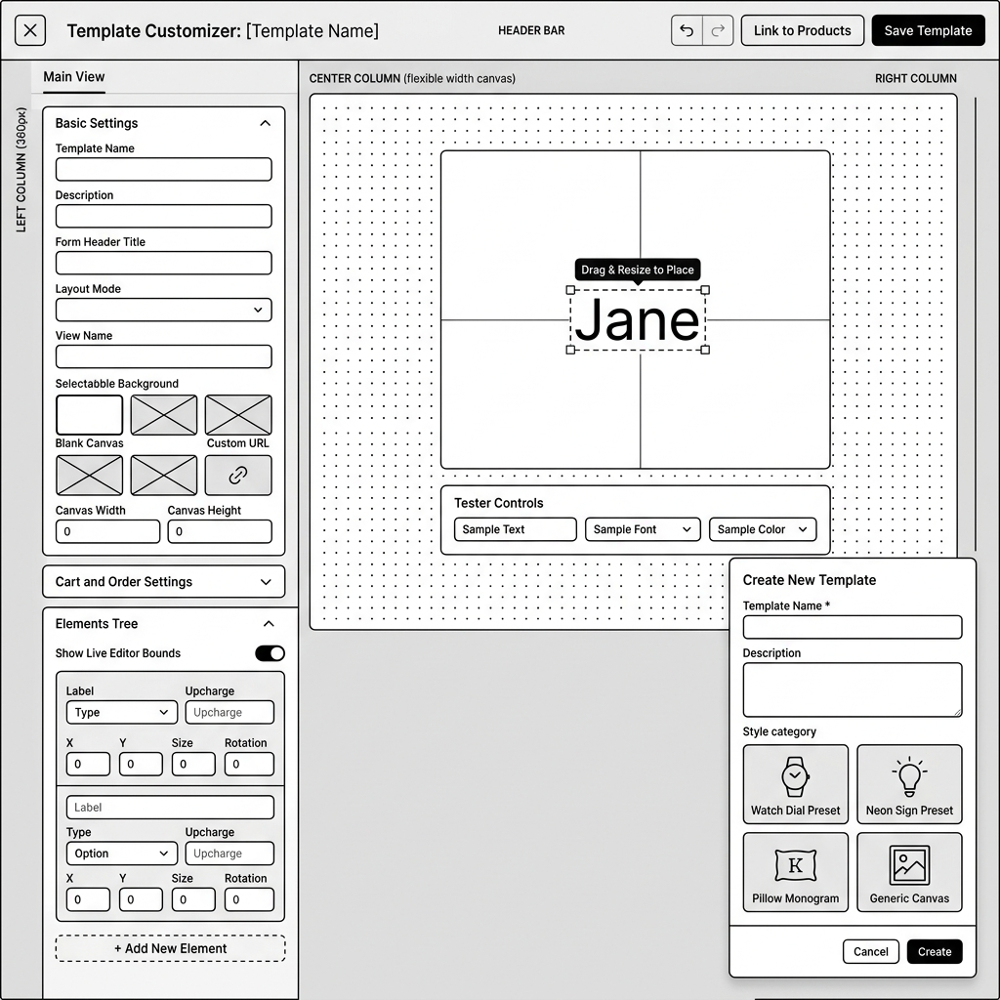
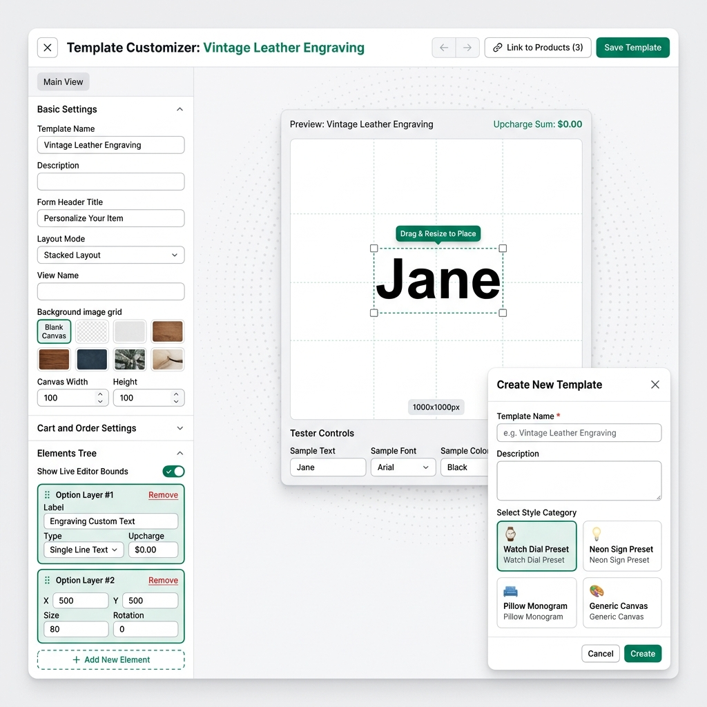
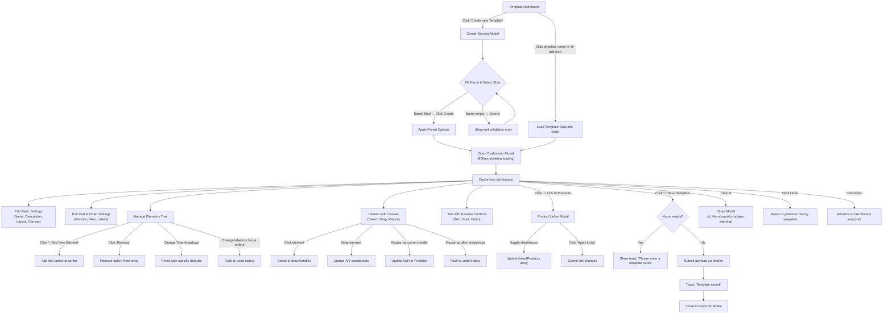

# UI/UX Research & Audit: Template Customizer Modal (Create/Edit)

* **Date:** 2026-06-05
* **Target URL:** `https://admin.shopify.com/store/africazones-store/apps/product-personalizer?page=templateCustomizer-64809`
* **Focus Area:** Create/Edit Template Modal — Full-screen Customizer overlay

## 0. Visual Reference & Exploration Recording




---

## 1. Overview

The **Template Customizer Modal** is the primary workspace for creating and editing reusable personalization templates in the Zepto Product Personalizer Shopify app. It presents a full-screen overlay (90vw × 90vh) containing:

- A **left sidebar** with configuration accordions (Basic Settings, Cart & Order, Elements Tree)
- A **center canvas** for WYSIWYG preview of element positioning with drag-and-resize interaction
- A **header toolbar** with Undo/Redo, product linking, and save actions

Two entry flows converge on this modal:
1. **Create Flow:** Dashboard → "Create New Template" button → Naming Modal (name, description, style preset) → Customizer Modal
2. **Edit Flow:** Dashboard → "Your Templates" tab → click template name or edit icon → Customizer Modal (pre-populated with saved data)

The target audience is **Shopify merchants and store administrators** who need to configure product personalization options (text engravings, color swatches, file uploads, clipart placements) and spatially position them on a manufacturing canvas.

---

## 2. User Persona

### Persona 1: "Custom Product Merchant — Alex"
- **Role:** Small business owner selling personalized jewelry, gifts, or apparel via Shopify
- **Goal:** Quickly set up and iterate on customization templates, preview how customer inputs will render, and link templates to products
- **Pain Points:** Limited design tool experience; needs visual feedback for placement decisions; wants to avoid coding or raw coordinate entry
- **Technical Level:** Low-to-medium; expects drag-and-drop simplicity

### Persona 2: "Production Manager — Sam"
- **Role:** Handles fulfillment and manufacturing file preparation
- **Goal:** Ensure canvas dimensions and element coordinates match physical product specifications; verify preview quality settings
- **Pain Points:** Needs precise numeric controls alongside visual canvas; needs Cart & Order settings to match production pipeline

---

## 3. Key Features & Functionalities

### 3.1 Create New Template Naming Modal

- **Visual & Aesthetic Design:** A centered 520px-wide modal card floating over a blurred backdrop overlay (`backdrop-filter: blur(4px)`). Clean white header with bold 16px title, white body with 20px padding, and a white footer with Cancel/Create buttons.
- **Trigger & Interaction:** Activated by clicking the green "Create new Template" button on the dashboard. The modal presents:
  - **Template Name** (required, validated on empty): Text input with placeholder "e.g. Vintage Leather Engraving". Displays red border (`1.5px solid #d32f2f`) and error message on empty submission.
  - **Description** (optional): Textarea with 80px min-height.
  - **Style Category Selector:** 2×2 grid of clickable cards — ⌚ Watch Dial Preset, 💡 Neon Sign Preset, 🛋️ Pillow Monogram, 🎨 Generic Canvas. Selected card gets `2px solid #008060` border and `#f4fbf7` background tint.
- **Validation & Logic:** Only the Template Name is validated. Style cards pre-populate heading, layout mode, canvas dimensions, and default option layers. On "Create", the naming modal closes and the full Customizer opens with an 800ms skeleton loading screen.

### 3.2 Customizer Header Toolbar

- **Visual & Aesthetic Design:** White bar with `16px 24px` padding, `1px solid #e1e3e5` bottom border, subtle `box-shadow: 0 1px 2px rgba(0,0,0,0.02)`. Left cluster: close ✕ button + "Template Customizer: [Name]" (16px bold, name in `#008060`). Right cluster: Undo/Redo segmented button group, "🔗 Link to Products (N)" outlined button, "💾 Save Template" green primary button.
- **Trigger & Interaction:**
  - **Undo/Redo:** Segmented button pair with `1px solid #babfc3` border, disabled state at 0.4 opacity when at history boundary. Reverts option array snapshots via `optionHistory` stack.
  - **Link to Products:** Opens the Product Linker Modal (z-index 10001) showing all store products with checkboxes.
  - **Save Template:** Triggers `fetcher.submit` with the full payload (heading, layoutMode, brand colors, canvas spec, cart settings, options array, product links).
  - **Close (✕):** Closes the modal directly. **No unsaved changes warning**.

### 3.3 Left Sidebar — Basic Settings Accordion

- **Visual & Aesthetic Design:** 360px-wide white panel with right border. Uses HTML `<details>` elements with custom summary styling (`13px bold, #2c3e50`), arrow indicator `➔` that rotates 90° on open.
- **Fields:**
  - Template Name — text input
  - Description — text input (single line, not textarea)
  - Form Header Title — text input (default: "Personalize Your Item")
  - Layout Mode — dropdown (`stacked` / `tabs` / `modal`)
  - View Name — text input (default: "Main View")
  - View Background — 3-column grid picker: "Blank Canvas" tile, image asset thumbnails from the asset library, and a "Custom URL" tile that reveals a URL input field when selected
  - Canvas Width / Canvas Height — side-by-side number inputs (min 500, max 5000)

### 3.4 Left Sidebar — Cart and Order Settings Accordion

- **Visual & Aesthetic Design:** Collapsed by default. Contains toggle switches with custom CSS slider (`38×20px`, green when checked).
- **Controls:**
  - Generate Preview Image — toggle (default: on)
  - Preview Size quality — dropdown (Compressed JPG / Full Quality PNG)
  - Include Additional Files — toggle (default: on)
  - Hide Background in order image — toggle (default: off)
  - Custom cart labels override — toggle (default: off)

### 3.5 Left Sidebar — Elements Tree Accordion

- **Visual & Aesthetic Design:** Open by default. Shows a "Show Live Editor Bounds" toggle at top, then a vertical stack of option layer cards (rounded 8px, `1px solid #ebebeb`, selected state `#008060` border + `#f4fbf7` background).
- **Option Layer Card Fields:**
  - Header row: "Option Layer #N" label + red "Remove" text button
  - Label — text input (triggers history push on blur)
  - Type — dropdown (Single Line Text, Dropdown Choice, Color Swatch Palette, File Decal Upload, Option Checkbox)
  - Upcharge ($) — number input with step 0.01
  - **Conditional fields by type:**
    - `text`: Canvas coordinate fields (X, Y, Size, Rotation)
    - `select` / `swatch`: Choices radio toggle (Custom vs Asset Link) + inline input/dropdown
    - `clipart` / `file`: Canvas coordinate fields (X, Y, W, H)
- **Add New Element:** Dashed-border green button at bottom. Creates a new `text` type option with default coordinates centered at (500, 500).

### 3.6 Center Canvas — WYSIWYG Preview

- **Visual & Aesthetic Design:** Flexible-width area with `#f4f5f6` background and radial dot pattern (`20px` spacing). Canvas wrapped in a white card with `12px` border-radius, `6px 30px` box-shadow.
- **Canvas Rendering:**
  - Draws alignment grid: outer boundary stroke + dotted 100px grid lines in `rgba(0,128,96,0.08)`
  - Text elements rendered with font/color from tester controls for the default option, or Arial black for subsequent options
  - Clipart/file elements rendered as filled/stroked rectangles with label text
  - Selected element: dashed green border, 4 corner resize handles (14×14px white squares with green stroke), and a green tooltip badge "Drag & Resize to Place" above
  - Dimension tag: `"{W}x{H}px logical viewport"` in monospace at bottom-right
- **Interactions:**
  - **Click to select:** Hit detection on element bounding boxes
  - **Drag to move:** Updates `canvasX`/`canvasY` in real-time
  - **Corner resize:** Handles adjust `canvasWidth`/`canvasHeight` or `canvasFontSize` for text
  - **Mouse up:** Pushes to undo/redo history

### 3.7 Tester Controls Panel

- **Visual & Aesthetic Design:** Below the canvas in a light gray `#f8f9fa` rounded panel. 3-column grid of test inputs.
- **Fields:**
  - Sample Text — text input (default: "Jane")
  - Sample Font — dropdown (Arial, Times New Roman, + uploaded font assets)
  - Sample Color — dropdown (Black, Crimson, Slate Blue, Dark Navy)
- **Behavior:** Changes are immediately reflected on the canvas for the first ("default") text option only.

### 3.8 Product Linker Modal

- **Visual & Aesthetic Design:** 480px modal card over the customizer (z-index 10001). Scrollable product list with checkboxes, product thumbnails (32×32), and product titles. Linked products get `#f0fbf7` background.
- **Behavior:** Toggles product IDs in `linkedProducts` array. "Apply Links" submits via `fetcher`. For built-in templates, it auto-creates a database copy first.

### 3.9 Built-in Template Preview Modal

- **Visual & Aesthetic Design:** 500px modal card. Shows template name, description, and a 300×300 canvas preview rendering all option elements at 0.6× scale. "Close" and "Duplicate blueprint" buttons in footer.

### 3.10 UI Component & Element Inventory

| Component / Element Name | Type | Default State / Value | Layout Placement & Parent Container |
|---|---|---|---|
| Close ✕ button | Button | — | Customizer Header (left) |
| Template title display | Text | "New Template" | Customizer Header (left) |
| Undo button | Button | Disabled (opacity 0.4) | Customizer Header (right, segmented group) |
| Redo button | Button | Disabled (opacity 0.4) | Customizer Header (right, segmented group) |
| Link to Products button | Button | "🔗 Link to Products (0)" | Customizer Header (right) |
| Save Template button | Button (primary) | "💾 Save Template" | Customizer Header (right) |
| Main View subtab | Tab pill | Active (only tab) | Sidebar top sub-tab bar |
| Template Name input | Input | "" / loaded value | Basic Settings accordion |
| Description input | Input | "" / loaded value | Basic Settings accordion |
| Form Header Title input | Input | "Personalize Your Item" | Basic Settings accordion |
| Layout Mode dropdown | Select | "stacked" | Basic Settings accordion |
| View Name input | Input | "Main View" | Basic Settings accordion |
| Background grid picker | Grid of tiles | "Blank Canvas" selected | Basic Settings accordion |
| Custom URL input | Input (conditional) | "" | Basic Settings accordion |
| Canvas Width number | Number input | 1000 | Basic Settings accordion |
| Canvas Height number | Number input | 1000 | Basic Settings accordion |
| Generate Preview toggle | Toggle switch | On (checked) | Cart & Order accordion |
| Preview Size dropdown | Select | "Compressed" | Cart & Order accordion |
| Additional Files toggle | Toggle switch | On (checked) | Cart & Order accordion |
| Hide Background toggle | Toggle switch | Off | Cart & Order accordion |
| Custom Cart Labels toggle | Toggle switch | Off | Cart & Order accordion |
| Show Live Editor Bounds toggle | Toggle switch | On (checked) | Elements Tree accordion |
| Option Layer card | Card component | Per-option data | Elements Tree accordion |
| Option Label input | Input | Option label text | Option Layer card |
| Option Type dropdown | Select | "text" | Option Layer card |
| Option Upcharge input | Number | 0 | Option Layer card |
| Choices type radio | Radio group | "Custom" | Option Layer card (select/swatch) |
| Choices input/dropdown | Input or Select | "" / asset id | Option Layer card (select/swatch) |
| X/Y/Size/Rot coordinate inputs | Number inputs | 500/500/80/0 | Option Layer card (text/clipart/file) |
| Remove option button | Text button (danger) | — | Option Layer card header |
| Add New Element button | Button (dashed) | — | Elements Tree accordion bottom |
| Canvas element | HTML Canvas | 1000×1000 | Customizer main area |
| Sample Text input | Input | "Jane" | Tester Controls panel |
| Sample Font dropdown | Select | "Arial" | Tester Controls panel |
| Sample Color dropdown | Select | "#000000" (Black) | Tester Controls panel |
| Create Template Name input | Input | "" | Create Naming Modal |
| Create Template Description | Textarea | "" | Create Naming Modal |
| Style Category cards (×4) | Selectable cards | "generic" selected | Create Naming Modal |
| Cancel button (create) | Button | — | Create Naming Modal footer |
| Create button | Button (primary) | — | Create Naming Modal footer |

---

## 4. User Flow & Information Architecture

### 4.1 Branching User Flow



### 4.2 Step-by-step User Journey (Create Flow)

1. User clicks **"Create new Template"** green button on dashboard
2. **Create Naming Modal** appears with backdrop blur
3. User types a template name (required field with red asterisk)
4. User optionally types a description
5. User selects one of 4 style category cards (Watch Dial / Neon Sign / Pillow / Generic)
6. User clicks **"Create"** → naming modal closes
7. **Skeleton loading screen** displays for 800ms (pulsing placeholder blocks)
8. **Customizer Modal** appears with pre-populated preset values
9. User adjusts Basic Settings (name, heading, layout mode, background, canvas size)
10. User opens **Elements Tree** → configures option type, label, upcharge, coordinates
11. User adds more elements via **"+ Add New Element"**
12. User interacts with **canvas** — drag to position, corner-resize to scale
13. User tests rendering with **Tester Controls** (sample text/font/color)
14. User clicks **"🔗 Link to Products"** → selects products → "Apply Links"
15. User clicks **"💾 Save Template"** → toast confirmation → modal closes

### 4.3 Hierarchical IA Tree

```
s-page[heading="Templates"]
├── <style> (550+ lines of inline CSS)
├── templates-tab-container (Dashboard list view)
│   ├── Header: "Templates" h1 + "Create new Template" button
│   ├── Tab bar: "Built-in Templates" | "Your Templates"
│   ├── Search bar
│   ├── [Tab 1] Built-in Templates table
│   └── [Tab 2] Your Templates table + Pagination
├── Create Naming Modal (isCreateModalOpen)
│   ├── generic-modal-overlay (z-index 10001)
│   └── generic-modal-card (520px)
│       ├── Header: "Create New Template" + ✕
│       ├── Body: Name input + Description textarea + Style cards grid
│       └── Footer: Cancel + Create buttons
├── Customizer Overlay Modal (isModalOpen)
│   ├── customizer-overlay (z-index 10000, backdrop blur)
│   └── customizer-card (90vw × 90vh)
│       ├── [Loading] Skeleton container (customizerLoading)
│       └── [Loaded] Fragment
│           ├── customizer-header
│           │   ├── Left: ✕ + Title
│           │   └── Right: Undo/Redo | Link to Products | Save Template
│           └── customizer-pane (flex row)
│               ├── customizer-sidebar (360px)
│               │   ├── Sub-tab bar: "Main View"
│               │   └── Scrollable accordion container
│               │       ├── <details> Basic Settings (open)
│               │       │   ├── Template Name, Description, Header Title
│               │       │   ├── Layout Mode, View Name
│               │       │   ├── Background grid picker + Custom URL
│               │       │   └── Canvas Width × Height
│               │       ├── <details> Cart and Order Settings
│               │       │   └── 4 toggles + 1 dropdown
│               │       └── <details> Elements Tree (open)
│               │           ├── Live Editor Bounds toggle
│               │           ├── Option Layer cards (dynamic list)
│               │           │   ├── Label, Type, Upcharge
│               │           │   ├── [Conditional] Choices (select/swatch)
│               │           │   └── [Conditional] Coordinates (text/clipart/file)
│               │           └── "+ Add New Element" button
│               └── customizer-main (flexible width)
│                   └── canvas-frame-container
│                       ├── Info row: Preview name + Upcharge sum
│                       ├── <canvas> (interactive, drag/resize)
│                       └── Tester Controls panel
│                           └── Sample Text, Font, Color
├── Built-in Preview Modal (isPreviewModalOpen)
│   └── generic-modal-card (500px)
│       ├── Header + Description
│       ├── Canvas preview (300×300)
│       └── Footer: Close + Duplicate
└── Product Linker Modal (isLinkModalOpen)
    └── generic-modal-card (480px)
        ├── Header + instructions
        ├── Scrollable product checklist
        └── Footer: Cancel + Apply Links
```

---

## 5. Visual Styling System (Color, Typography, Spacing)

### Color Palette

| Token | HEX / RGBA | Usage |
|---|---|---|
| Page background | `#f4f5f6` | Canvas area background |
| Panel background | `#ffffff` | Sidebar, cards, modals |
| Subtle background | `#fafafa` | Tab bars, modal headers, table headers |
| Hover background | `#f1f2f4` | Button hover, skeleton |
| Selected tint | `#f4fbf7` | Selected option card, create modal style card |
| Primary brand | `#008060` | Buttons, accents, selection borders, canvas elements |
| Primary hover | `#006e52` | Primary button hover |
| Danger red | `#d93838` | Delete buttons, remove text, validation errors |
| Danger hover | `#be2e2e` | Danger button hover |
| Validation error | `#d32f2f` | Input border + error message text |
| Text primary | `#202223` / `#1a1a1a` | Headings, bold labels |
| Text body | `#2c3e50` | Card titles, option labels |
| Text secondary | `#6d7175` | Descriptions, sub-labels, placeholders |
| Text muted | `#8c9196` | Disabled text, coordinate labels, empty states |
| Border default | `#babfc3` | Input borders, button borders |
| Border light | `#ebebeb` | Accordion dividers, card borders, table rows |
| Border subtle | `#e1e3e5` | Header bottom border |
| Border ultra-light | `#f3f3f3` | Table row dividers |
| Toggle on | `#008060` | Checked toggle slider background |
| Toggle off | `#cccccc` | Unchecked toggle slider background |
| Overlay | `rgba(0,0,0,0.4)` | Modal backdrops |
| Overlay blur | `blur(8px)` customizer / `blur(4px)` generic | Backdrop filter |

### Typography

| Element | Font | Size | Weight | Color |
|---|---|---|---|---|
| Page h1 | System default | 18px | 700 | `#1a1a1a` |
| Modal title (create) | System default | 16px | 700 | `#1a1a1a` |
| Customizer header title | System default | 16px | 700 | `#202223` (name in `#008060`) |
| Accordion summary | System default | 13px | 700 | `#2c3e50` |
| Input labels | System default | 11px | 600 | `#6d7175`, uppercase |
| Create modal labels | System default | 13px | 600 | `#212529` |
| Input text | System default | 13px | 400 | Default |
| Button text | System default | 13px | 600 | Varies |
| Option layer title | System default | 12px | 700 | `#2c3e50` / `#008060` (selected) |
| Coordinate labels | System default | 10px | 400 | `#6d7175` |
| Tiny labels (type/upcharge) | System default | 9px | — | `#8c9196`, uppercase |
| Canvas dimension tag | Monospace | 14px | 700 | `#6d7175` |
| Badge tags | System default | 11px | 600 | `#2c3e50` |

### Spacing & Corner Styles

| Property | Value | Element |
|---|---|---|
| Modal border-radius | 14px | Customizer card |
| Generic modal radius | 12px | Create, linker, preview modals |
| Card radius | 8px | Option layer cards, tester controls panel |
| Input radius | 6px | All text inputs, selects, buttons |
| Button padding | 8px 16px | Standard `.customizer-btn` |
| Accordion summary padding | 14px 16px | Sidebar accordion headers |
| Accordion content padding | 0 16px 16px | Accordion body |
| Sidebar width | 360px | Fixed left panel |
| Canvas max-width | 450px (CSS) | Canvas display constraint |
| Canvas max-height | 480px (CSS) | Canvas display constraint |
| Canvas card padding | 16px | Canvas frame container |
| Grid gap (options) | 10px | Option layer card stack |
| Grid gap (coordinates) | 6px | X/Y/Size/Rot fields |

### Box Shadows

| Element | Value |
|---|---|
| Dashboard container | `0 4px 20px rgba(0,0,0,0.03)` |
| Customizer card | `0 10px 40px rgba(0,0,0,0.15)` |
| Generic modal card | `0 8px 30px rgba(0,0,0,0.15)` |
| Canvas frame | `0 6px 30px rgba(0,0,0,0.06)` |
| Customizer header | `0 1px 2px rgba(0,0,0,0.02)` |
| Active sub-tab pill | `0 1px 3px rgba(0,0,0,0.05)` |

---

## 6. UI/UX Analysis (Core Audit)

### Heuristic Evaluation

| Heuristic | Rating | Assessment |
|---|---|---|
| **Visibility of system status** | ⚠️ Moderate | Skeleton loading provides status during open, but there is **no saving progress indicator** — the save action submits silently with only a toast on completion. No spinner or disabled button during save. Undo/Redo buttons show history position via opacity but don't indicate stack depth (e.g., "3 of 7"). |
| **Match between system and real world** | ✅ Good | Domain terminology from CONTEXT.md is used well: "Template", "Elements Tree", "Customizer", "Personalization Config". Layout mode options (Stacked, Tabs, Modal) map to real storefront presentations. Canvas coordinates match manufacturing dimensions. |
| **User control and freedom** | ⚠️ Needs Work | **Critical gap:** Closing the Customizer modal (✕) provides **no "unsaved changes" confirmation dialog**. Users can accidentally lose extensive configuration work. Undo/Redo is well-implemented for option changes but **does not cover** Basic Settings or Cart & Order changes. No keyboard shortcut support (Ctrl+Z/Ctrl+Y). |
| **Consistency and standards** | ✅ Good | Consistent use of Shopify's green (#008060) for primary actions. Toggle switches, input fields, and button styles are uniform throughout. Accordion pattern is consistent. However, the description field is a `<textarea>` in the Create modal but a single-line `<input>` in the Customizer sidebar — inconsistency. |
| **Error prevention** | ⚠️ Moderate | Template name is validated on create, and the save action checks for empty names with a toast. However: no max-length constraints on name/description, no validation on canvas dimension bounds in the UI (only JS clamping), and **deleting an element has no confirmation** — the "Remove" button fires immediately. |
| **Recognition rather than recall** | ✅ Good | Style category cards in the create modal use visual emojis and descriptions. The canvas provides live WYSIWYG preview. The Tester Controls let users see real-time rendering. However, coordinate fields use cryptic abbreviations (X, Y, Size, Rot) with no tooltips. |
| **Flexibility and efficiency of use** | ⚠️ Moderate | Canvas drag-and-resize is excellent for visual users, but there's **no keyboard shortcuts** for power users (Ctrl+Z, Ctrl+S, Delete key to remove selected element). No right-click context menu on canvas elements. No copy/paste for option layers. |
| **Aesthetic and minimalist design** | ✅ Good | Clean Shopify-aligned design with good use of whitespace, consistent card elevation hierarchy, and clear visual grouping via accordions. The dotted grid background and canvas shadows create clear spatial separation. |
| **Help users recognize, diagnose, and recover from errors** | ⚠️ Moderate | Validation error on the create modal is clear (red border + text). Save failure shows a toast with error message. However, there's **no inline validation** in the Customizer sidebar (e.g., no feedback for duplicate template names, invalid upcharge values, or empty option labels). |
| **Help and documentation** | ❌ Poor | **No contextual help, tooltips, or onboarding** is provided. New users see no guidance on what "Layout Mode" means, how canvas coordinates work, what "Cart Transform" settings affect, or how to use the background picker. No "?" icons, no info popovers, no first-time walkthrough. |

### Pros — What Works Well

1. **WYSIWYG Canvas Interaction:** Drag-and-resize with visual handles, selection highlighting, and tooltip badges is well-executed and immediately understandable.
2. **Style Preset System:** The 4-card style category picker in the create modal provides excellent scaffolding — users start with sensible defaults rather than a blank slate.
3. **Skeleton Loading Screen:** The 800ms skeleton transition during modal open prevents the jarring flash of unloaded content and signals that work is happening.
4. **Undo/Redo History Stack:** Option-level undo/redo is a mature feature that prevents destructive editing mistakes. History pushes on meaningful boundaries (mouse-up, blur, type change).
5. **Accordion Organization:** Three collapsible sections (Basic, Cart, Elements) keep a complex form manageable without overwhelming the viewport.
6. **Live Tester Controls:** The sample text/font/color panel below the canvas lets merchants preview real personalization rendering without leaving the editor.
7. **Dotted Alignment Grid:** The 100px dotted grid on the canvas helps with spatial alignment and gives the canvas a professional design-tool feel.

### Cons / Friction Points

1. **🔴 No Unsaved Changes Warning:** Closing the modal with ✕ silently discards all work. This is the highest-risk UX issue — users can lose minutes of configuration with one misclick.
2. **🔴 No Save Progress Indicator:** The save button doesn't show a loading spinner, doesn't disable during submission, and doesn't visually acknowledge the async operation. Users may double-click or navigate away.
3. **🟡 Description Field Inconsistency:** The Create modal uses a `<textarea>` for description while the Customizer sidebar uses a single-line `<input>`. This breaks user expectations about multiline content.
4. **🟡 No Element Removal Confirmation:** Clicking "Remove" on an option layer immediately deletes it with no confirmation, yet the element might have significant coordinate configuration.
5. **🟡 No Keyboard Shortcuts:** No Ctrl+Z (undo), Ctrl+Y (redo), Ctrl+S (save), Delete (remove selected), or Escape (close). Power users expect these in editor-style interfaces.
6. **🟡 Missing Contextual Help:** Zero tooltip icons, no "learn more" links, no onboarding hints for first-time users. Settings like "Hide Background in order image" and "Custom cart labels override" are opaque without context.
7. **🟡 Single-View Tab Bar:** The "Main View" sub-tab in the sidebar has no sibling tabs and no ability to add views. It occupies space with no functionality and confuses users about whether multi-view support exists or is coming.
8. **🟠 Tester Controls Limited to First Option:** Only the first ("default") text option responds to the sample text/font/color controls. Additional text elements are rendered with hardcoded "Arial" and their label text, with no way to preview them dynamically.
9. **🟠 No Canvas Zoom/Pan:** The canvas is fixed at `max-width: 450px` with `aspect-ratio` scaling. There's no zoom slider, scroll-to-zoom, or pan ability. For large canvases (e.g., 5000×5000), elements become tiny and hard to select.
10. **🟠 No Element Reordering:** Option layers in the Elements Tree cannot be reordered via drag-and-drop. Their z-order is fixed by array index.

---

## 7. Technical UI Design Deliverables

### Low-Fidelity UX Skeleton Wireframe


*Structural layout skeleton of the Template Customizer Modal showing the full-width header toolbar, 360px left sidebar with three accordion panels (Basic Settings, Cart & Order Settings, Elements Tree), flexible-width center canvas area with tester controls, and the overlaid Create New Template naming modal with 2×2 style category card grid.*

### High-Fidelity Mockup Specification


**Visual Redesign Design Tokens:**

| Token | Current | Recommended | Rationale |
|---|---|---|---|
| Font family | Browser default | `Inter, -apple-system, sans-serif` | Consistent with modern Shopify admin typography |
| Accordion arrow | `➔` character entity | SVG chevron icon | More polished, scalable, consistent with Polaris |
| Save button icon | `💾` emoji | SVG floppy disk or checkmark icon | Emoji rendering varies across OS; SVG is consistent |
| Link button icon | `🔗` emoji | SVG chain/link icon | Same as above |
| Coordinate label style | 10px plain text | 10px monospace with subtle background pill | Improves scanability of numeric values |
| Remove button | Red text | Red icon button with trash SVG + confirm popover | Prevents accidental deletion |
| Tooltip badge | Canvas-drawn rect | CSS-positioned `<div>` overlay with animation | Smoother rendering, accessible to screen readers |

**Container Layout & Dimension Constraints:**

| Container | Width Rule | Height Rule | Overflow | Notes |
|---|---|---|---|---|
| Customizer overlay | `100vw × 100vh` fixed | — | Hidden | Full viewport backdrop |
| Customizer card | `90vw` | `90vh` | Hidden | Flex column, card fills viewport |
| Header toolbar | Full width | `64px` fixed | — | Flex row, space-between |
| Sidebar | `360px` fixed | `calc(90vh - 64px)` | `overflow-y: auto` | Scrollable when content exceeds |
| Canvas area | `flex: 1` (remaining) | Full height | `overflow-y: auto` | Centers canvas vertically |
| Canvas element | `max-width: 450px` | `aspect-ratio: W/H` | — | Maintains logical proportions |
| Create naming modal | `520px` fixed | Auto (content) | `max-height: 80vh` | Centered overlay |
| Product linker modal | `480px` fixed | Auto (content) | `max-height: 80vh`, body scrollable | Centered overlay |

---

## 8. Design Recommendations & Actionable Improvements

| # | Recommendation | Impact | Effort | Priority |
|---|---|---|---|---|
| 1 | **Add unsaved changes confirmation dialog** when closing via ✕. Track a `isDirty` flag by comparing current state against initial loaded state. | 🔴 High | Low | P0 — Critical |
| 2 | **Disable save button and show spinner** during `fetcher.state === "submitting"`. Prevent double-submit. | 🔴 High | Low | P0 — Critical |
| 3 | **Add element removal confirmation** — either a popover "Are you sure? This cannot be undone." or leverage undo to auto-push before removing. | 🟡 Medium | Low | P1 |
| 4 | **Add keyboard shortcuts**: Ctrl+Z (undo), Ctrl+Shift+Z (redo), Ctrl+S (save), Delete (remove selected element), Escape (close modal with dirty check). Register via `useEffect` with `keydown` listener. | 🟡 Medium | Medium | P1 |
| 5 | **Unify description field** — use `<textarea>` in both Create modal and Customizer sidebar for consistency. | 🟢 Low | Low | P1 |
| 6 | **Add contextual help icons** (ℹ️) next to complex settings like "Layout Mode", "Hide Background in order image", "Custom cart labels override". Use Polaris `Tooltip` or a simple CSS tooltip. | 🟡 Medium | Medium | P2 |
| 7 | **Extend tester controls to all text options**, not just the first. Add a dropdown to select which option layer to preview, or render each text element with its own sample text state. | 🟡 Medium | Medium | P2 |
| 8 | **Add canvas zoom controls** — a zoom slider (50%-200%) and optional scroll-to-zoom. This becomes essential for large canvas dimensions (2000px+). | 🟡 Medium | High | P2 |
| 9 | **Add drag-and-drop reordering** for option layer cards in the Elements Tree. Use a drag handle grip icon and reorder the options array. | 🟡 Medium | Medium | P2 |
| 10 | **Remove or repurpose the "Main View" single tab** — either hide the sub-tab bar when there's only one view, or build out multi-view support (Front, Back, Inside). | 🟢 Low | Low | P3 |
| 11 | **Replace emoji icons** (💾, 🔗, ⌚, 💡, 🛋️, 🎨) with SVG icons for cross-platform rendering consistency. | 🟢 Low | Medium | P3 |
| 12 | **Add auto-save draft** functionality — periodically save to localStorage every 30 seconds so users can recover work if the browser crashes or they accidentally navigate away. | 🟡 Medium | High | P3 |

---

## 9. Conclusion

The Template Customizer Modal is a **feature-rich, well-structured editor** that successfully combines a sidebar configuration panel with a WYSIWYG canvas preview. The style preset system, undo/redo history, skeleton loading, and drag-and-resize interactions demonstrate mature UX thinking.

However, there are two **critical safety gaps** — the lack of an unsaved changes confirmation dialog and the absence of save-in-progress feedback — that create real risk of data loss for merchants. These are P0 fixes.

Beyond safety, the modal would benefit from keyboard shortcuts (P1), contextual help for non-obvious settings (P2), and canvas zoom controls (P2) to serve both novice and power-user personas effectively.

The overall design maturity is **3.5 / 5** — solid foundation with clear improvement vectors that would elevate it to a professional-grade design tool experience.

---

## 10. Open Questions / Clarifications

1. **Multi-view support:** The "Main View" tab implies future multi-view capability (e.g., front/back/inside of a product). Is this planned? If so, the UI should telegraph it with a disabled "+" tab. If not, the tab bar should be removed to reduce confusion.

2. **Canvas coordinate system:** Are canvas coordinates (0,0 at top-left) always absolute pixel values, or should they support percentage-based positioning for responsive product images? This affects whether a zoom/pan system is viable.

3. **Undo scope:** Currently only option array changes are tracked in the history stack. Should Basic Settings changes (name, layout mode, heading) and Cart & Order toggle changes also be undoable? This would require a broader state snapshot approach.

### Manual Exploration Recommendations

- **System Integrations:** The `PersonalizationConfigSync.syncTemplate` server action propagates template data to Shopify product metafields. Verify that editing and re-saving correctly updates linked products by manually checking metafield values in the Shopify admin.
- **Micro-interactions & Small Elements:** The canvas resize handles (14×14px corner squares) and the element hit detection threshold (40px) should be manually tested on both mouse and touch/trackpad inputs to verify feel. The tooltip badge "Drag & Resize to Place" is canvas-drawn and should be checked for rendering clarity at different zoom levels.
- **Out-of-Scope Sub-features & Connected Flows:** The **Product Linker Modal** and **Built-in Template Preview Modal** were documented structurally but not deeply audited for their own UX patterns. The **storefront rendering** of these templates (how the Customizer widget appears to end customers) is a separate audit area connected via the Layout Mode setting.
