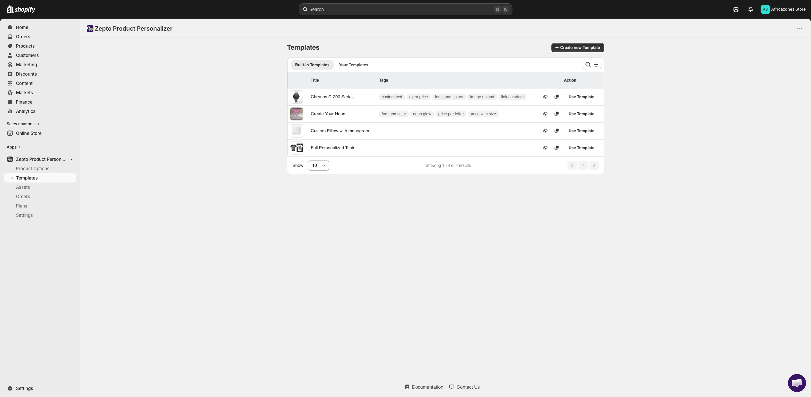
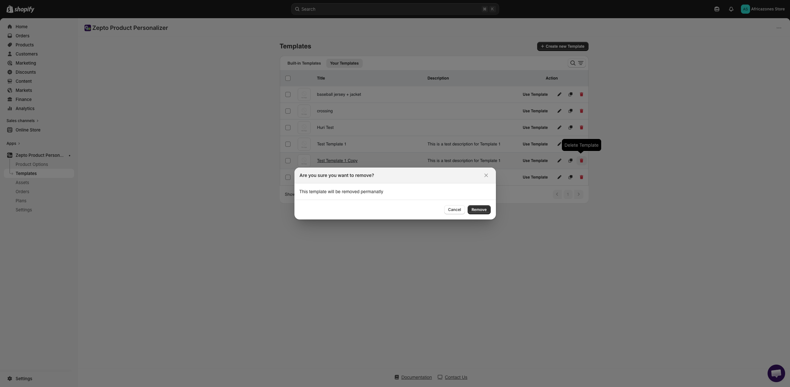
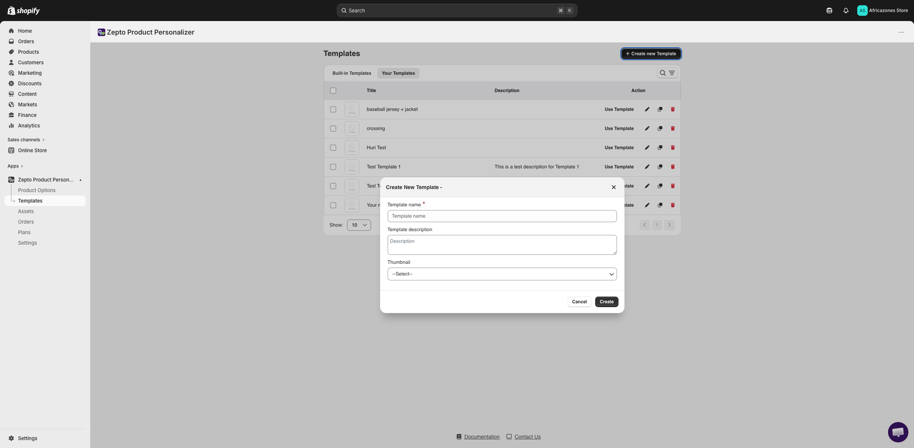
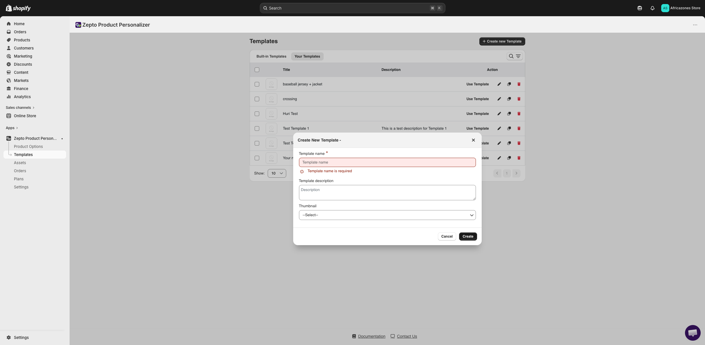
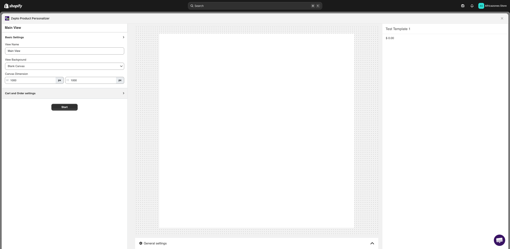
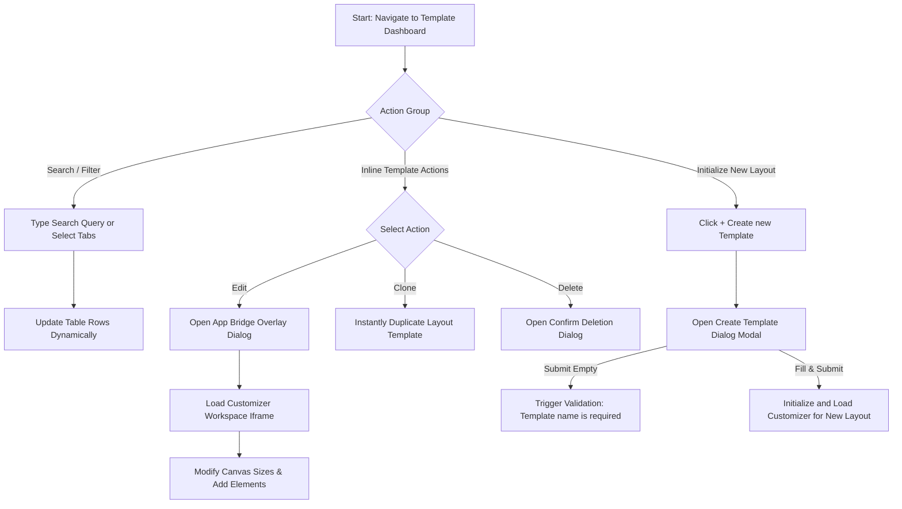
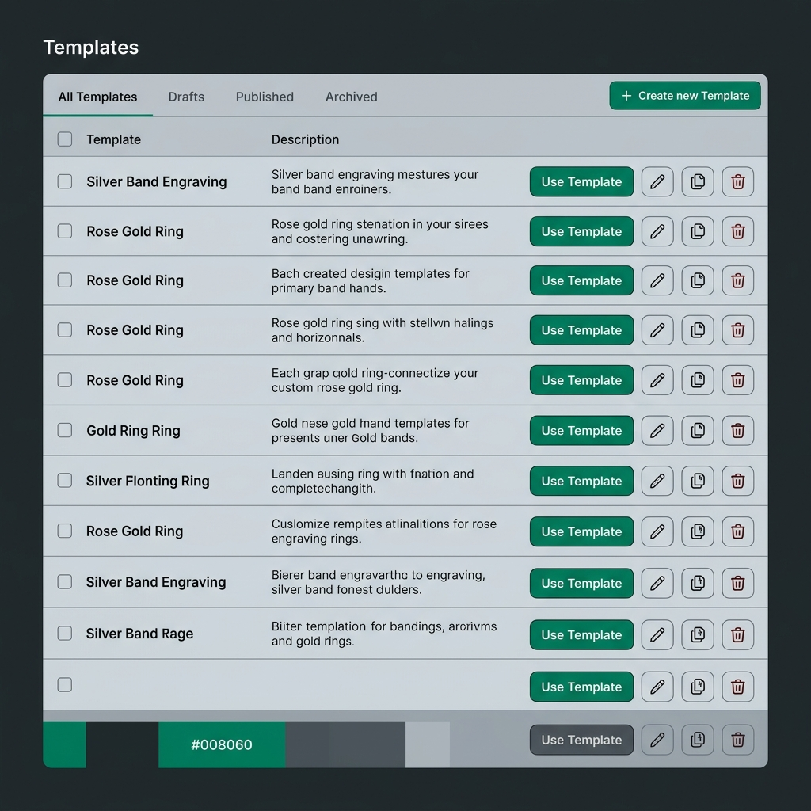

# UI/UX Research & Audit: Zepto Product Personalizer Template Dashboard

* **Date:** 2026-06-05
* **Target URL:** [https://admin.shopify.com/store/africazones-store/apps/product-personalizer/template](https://admin.shopify.com/store/africazones-store/apps/product-personalizer/template)
* **Focus Area:** Template Dashboard (Template management lists, creation flow, inline actions, and full-page customizer editor modal integration).

---

## 0. Visual Reference & Exploration Recording

### Exploration Recording
* [Exploration Recording](assets/zepto-product-personalizer_template-dashboard/recording.webm)
*(Note: An interactive screen recording of the browser exploration session is saved as `recording.webm` inside the assets directory.)*

### Audited UI States

| Audited UI State | Visual Link |
| :--- | :--- |
| **Main Dashboard Listing** |  |
| **Template Row Actions (Inline)** |  |
| **Create Template Dialog Modal** |  |
| **Validation Error State** |  |
| **Template Details Editor (Customizer Overlay)** |  |

---

## 1. Overview
The **Zepto Product Personalizer Template Dashboard** provides merchants with a centralized area to manage their reusable design layouts. Instead of defining customization elements individually for every product, merchants can create design "Templates" (e.g. customized canvas sizes, predefined input elements, upload areas, background images) and apply them to multiple products. 

The dashboard features tabbed navigation between built-in layouts and merchant-created layouts, search/filter controls, direct inline actions (Use, Edit, Clone, Delete), a modal-based creation interface, and a full-page customizer workspace that loads in a nested cross-origin context.

---

## 2. User Persona

### Primary Persona: Sophia, E-Commerce Store Manager
* **Goals:**
  * Create standard personalization canvases (e.g. 1:1 ratio engravings, banner uploads, customized watch faces) once, and link them to newly added product collections in seconds.
  * Rapidly clone and iterate on complex templates (e.g. duplicating "Father's Day Engraving" to create "Mother's Day Engraving") without starting from scratch.
  * Seamlessly toggle layouts and preview live designs in real-time as elements are added.
* **Pain Points:**
  * Navigating full-page nested editor interfaces that obscure dashboard context and make it difficult to return to the catalog listing.
  * Incomplete typography and visual styling feedback, such as icon-only actions that do not provide clear hover labels, causing accidental deletions.
  * Layout shifts and delay states due to nested cross-origin iframe setups.

---

## 3. Key Features & Functionalities

### A. Template Listing Index
* **Visual & Aesthetic Design:** A Shopify Polaris v12 index table grid. Features a clean, horizontal row list with columns for batch checkboxes, Template Title, Description, and Action controls.
* **Trigger & Interaction:** Clicking row buttons triggers operations:
  * **Use Template:** Starts a catalog linking flow.
  * **Edit (`` pencil):** Opens the template customizer view in a full-screen App Bridge overlay dialog containing a nested app iframe.
  * **Clone (`` copy):** Duplicates the template layout directly.
  * **Delete (`` trash):** Opens a deletion confirmation warning.
* **Validation & Logic Checks:** Table rows feature cursor pointer changes and hover highlights (subtle translucent backgrounds) to clarify bounding boxes.

### B. Navigation & Filtering Bar
* **Visual & Aesthetic Design:** Features navigation tabs separating "Your Templates" (currently active) from "Built-in Templates". Beneath the tabs, a search input bar is paired with a search icon button.
* **Trigger & Interaction:** Tab clicks toggle content groups instantly. Typing in the search input filters rows dynamically.
* **Validation & Logic Checks:** The search is instant, updating row listings dynamically and resetting the pagination index to avoid empty page layouts.

### C. Create Template dialog Modal
* **Visual & Aesthetic Design:** An App Bridge styled modal dialog displaying input fields in a clean column.
* **Trigger & Interaction:** Click "+ Create new Template" button in the top-right page header to display the modal overlay.
* **Validation & Logic Checks:** 
  * "Template name *" is designated as a required field.
  * If the user submits the form empty, a red error text label appears: `"Template name is required"`.
  * The thumbnail selector combobox defaults to `--Select--`.

### D. Template Details Customizer Workspace
* **Visual & Aesthetic Design:** A three-pane layout loaded in a full-page overlay iframe:
  * **Left Sidebar Settings Panel:** Contains collapsible accordion sections for View Name, Backgrounds, Canvas Dimensions, Cart settings, and Preview triggers.
  * **Main Canvas Editor Area:** Visualizes the canvas bounds. Displays "+ Add New Element" and "+ Add New View" controls.
  * **Top Bar Info Area:** Displays the current template name and the configuration's base price.
* **Trigger & Interaction:** Dimension changes update the canvas bounding box in real time. Switch toggles (e.g., Live Preview, Generate Preview) update editor rendering paths instantly.
* **Validation & Logic Checks:** Width and height inputs are constrained between `500px` and `5000px`. Saving changes initiates asynchronous background validations.

---

### 3.1 UI Component & Element Inventory

| Component / Element Name | Type (Button, Dropdown, Toggle, Card, Input) | Default State / Value | Layout Placement & Parent Container |
| :--- | :--- | :--- | :--- |
| **Create Template** | Button (Primary) | Visible / Active | Top-right corner of Page Header |
| **Your Templates Tab** | Tab Button | Active / Selected | Left side of Navigation Row |
| **Built-in Templates Tab** | Tab Button | Inactive | Right side of Navigation Row |
| **Search Input** | Input (Text) | Empty | Under navigation tabs, full width |
| **Use Template** | Button (Secondary) | Visible / Active | Table Row - Action Column |
| **Edit Template ()** | Button (Icon-only) | Visible / Active | Table Row - Action Column |
| **Clone Template ()** | Button (Icon-only) | Visible / Active | Table Row - Action Column |
| **Delete Template ()** | Button (Icon-only) | Visible / Active | Table Row - Action Column |
| **Template Name** | Input (Text) | Empty | Create Modal Form |
| **Template Description** | Text Area | Empty | Create Modal Form |
| **Thumbnail Select** | Dropdown | `--Select--` | Create Modal Form |
| **Width (W) / Height (H)** | Input (Number) | `1000px` / `1000px` | Editor Left Settings Pane |
| **Add New Element** | Button | Visible / Active | Center Workspace Canvas |

---

## 4. User Flow & Information Architecture

### Branching User Flow



### Hierarchical Information Architecture Tree

```
Template Dashboard Root
├─ Page Header
│  ├─ Title: "Templates"
│  └─ Primary Button: "+ Create new Template"
├─ Tabbed Navigation Row
│  ├─ Tab: "Your Templates" (Default Active)
│  └─ Tab: "Built-in Templates"
├─ Search Controls Container
│  └─ Search Input ("Search and filter products")
├─ Templates List Data Grid Table
│  ├─ Table Head (Checkbox, Title, Description, Action)
│  └─ Table Body (Rows listing custom templates)
│     ├─ Selection Checkbox
│     ├─ Template Name
│     ├─ Optional Description Text
│     └─ Action Group
│        ├─ Button: "Use Template"
│        ├─ Button (Icon-only): Edit (pencil)
│        ├─ Button (Icon-only): Clone (copy)
│        └─ Button (Icon-only): Delete (trash)
├─ Create Template Modal Overlay
│  ├─ Modal Title: "Create New Template"
│  ├─ Field Label: "Template name *" (Input text)
│  ├─ Field Label: "Template description" (Textarea)
│  ├─ Field Label: "Thumbnail" (Select dropdown)
│  └─ Modal Footer Actions (Cancel button, Create button)
└─ Customizer Editor Overlay
   ├─ Overlay Header (Template Name & Base Price "$0.00")
   ├─ Settings Panel (Left Sidebar)
   │  ├─ Basic Settings (View Name input, Background canvas select)
   │  ├─ Canvas Dimensions (W / H numeric inputs)
   │  └─ Preview & Image Settings (Switch toggles)
   └─ Workspace Canvas (Center/Right Area)
      ├─ Canvas Element Area
      └─ Action Button: "+ Add New Element"
```

---

## 5. Visual Styling System (Color, Typography, Spacing)

Audited design parameters extracted from the dashboard layout:

* **Color Palette:**
  * **Page Background:** `#f6f6f7` (Standard Shopify neutral page background)
  * **Card & Panel Backgrounds:** `#ffffff` (Cards, Table cells, and Modal containers)
  * **Primary Text Color:** `#212529` / `rgb(33, 37, 41)` (Primary labels, titles, table headers)
  * **Secondary Text Color:** `#4a4a4a` / `rgb(74, 74, 74)` (Tab descriptions, subtext descriptions)
  * **Primary Action Header Button Background:** `#303030` / `rgb(48, 48, 48)` (Dark Gray charcoal button)
  * **Table Row Border Divider:** `1px solid #dee2e6` / `rgb(222, 226, 230)`
  * **Required Star Indicator:** `#d32f2f` (Alert red)
* **Typography:**
  * **Font Stack:** `-apple-system, BlinkMacSystemFont, "Segoe UI", Roboto, sans-serif`
  * **Page Title / Headers:** `14px` weight `700` (Bold)
  * **Template Title Labels:** `13px` weight `600`
  * **Body Subtitles & Meta Details:** `12px` weight `400`
* **Spacing, Corners & Elevation:**
  * **Border Radii:** `8px` for modal windows and header card wrappers, `6px` for text inputs, `6px` for primary buttons.
  * **Paddings:** `24px` outer layout spacing, `12px` tab row element padding, `7px 15px` table cell padding.
  * **Row Heights:** `51px` standard template row height.
  * **Box Shadows:** `inset 0 -1px 0px 1px rgba(0,0,0,0.8)` on button accents, `0 2px 8px rgba(0,0,0,0.05)` on cards.

---

## 6. UI/UX Analysis (Core Audit)

### Heuristic Evaluation

1. **Visibility of System Status:**
   * *Pros:* Form validations trigger instantly when submitting empty values, displaying red alert states immediately.
   * *Cons:* When loading the Customizer Editor overlay, the double-nested iframe configuration takes time to resolve, causing a blank screen/loading delay without a clear loading progress indicator.
2. **Match Between System and Real World:**
   * *Pros:* Standard terms like "Template name" and "Canvas Width/Height" are used.
   * *Cons:* The thumbnail selector defaults to `--Select--` and uses technical references rather than displaying small icon previews, which makes it harder for merchants to select thumbnails.
3. **Consistency and Standards:**
   * *Pros:* Typography, backgrounds, and tab selectors align with Shopify Polaris styles, providing a cohesive feel.
   * *Cons:* Row action icons (Edit, Clone, Delete) are displayed as raw font glyphs (``, ``, ``) with styling that is inconsistent with standard Shopify Polaris action buttons.
4. **User Control and Freedom:**
   * *Pros:* Clear "Cancel" buttons are available on all creation modals. The editor overlay features a simple Close button.
   * *Cons:* There is no confirmation dialog when clicking the Clone action, which can result in multiple duplicate templates if double-clicked.

### Pros
* **Clean Tabbed Index:** Keeping "Built-in Templates" and "Your Templates" separate prevents clutter.
* **Inline Actions:** Placing Edit, Clone, and Delete buttons directly on each row makes template management fast and efficient.
* **Real-time Canvas Scaling:** Modifying canvas dimensions immediately rescales the editor preview canvas.

### Cons & Friction Points
* **Missing Tooltips & Labels:** The icon-only row action buttons lack tooltips and aria-labels. This makes the actions unclear and creates accessibility issues.
* **Overlay Transition Latency:** Loading the editor iframe within an overlay modal is slow and results in transition lag.

---

## 7. Technical UI Design Deliverables

### Low-Fidelity UX Skeleton Wireframe
The wireframe emphasizes the layout hierarchy, column divisions, and action boundaries.


### High-Fidelity Mockup Specification
The mockup redesigns the table cells, replaces raw icon glyphs with Polaris-compliant button shapes, and adds clear visual hierarchies.



#### Redesign Design Tokens
* **Theme Colors:** Polaris Emerald `#008060` (Primary Action button background), Neutral gray borders `#babfc3` (Tabs and Input wrappers).
* **Typography:** `Inter, sans-serif` base font.
  * *Headers:* `16px`, weight `700`.
  * *Labels:* `13px`, weight `600`.
  * *Subtext:* `12px`, weight `400`.
* **Elevations:** Use simple border outlines (`1px solid #ebebeb`) instead of heavy dropshadows to align with Shopify Admin pages.
* **Border Radii:** Card containers rounded at `8px`, buttons and search bars rounded at `6px`.

---

## 8. Design Recommendations & Actionable Improvements

| Recommended Action | Impact | Effort | Priority |
| :--- | :--- | :--- | :--- |
| **Row Button Tooltips:** Replace the raw font-glyph row action icons with standard Polaris icon buttons that include clear tooltips and `aria-label` tags. | **High** | **Low** | **High** |
| **Clone Confirmation:** Add a quick toast notification or confirmation modal for the Clone action to prevent accidental duplications. | **Medium** | **Low** | **High** |
| **Visual Thumbnail Previews:** Replace the dropdown combo-box for thumbnails in the template creation modal with a visual grid picker showing image previews. | **High** | **Medium** | **Medium** |
| **Editor Skeleton Loader:** Add a skeleton placeholder animation inside the Customizer modal to make the iframe loading state feel faster and reduce layout shifts. | **High** | **Medium** | **Medium** |

---

## 9. Conclusion
The Zepto Product Personalizer Template Dashboard provides a clear, tabbed directory for managing design templates. Migrating row action buttons to standard Polaris icon buttons with hover tooltips will fix key accessibility and usability issues. Additionally, adding skeleton loaders for iframe transitions will make the customizer load state feel faster and smoother for merchants.

---

## 10. Open Questions / Clarifications

### Clarification Questions
1. **Template Categorization:** Should we add a tagging system for templates to help merchants organize their layouts into folders or collections?
2. **Template Previews:** Should we generate a mini thumbnail preview of the template's actual canvas elements to display in the dashboard table rows?

### Manual Exploration Recommendations
* **Micro-interactions:** Test the row actions under touch-screen settings to ensure the target sizes are large enough.
* **Out-of-Scope Connected Flows:** Inspect the built-in catalog linking flow after clicking the "Use Template" button to verify how templates are linked to products.
