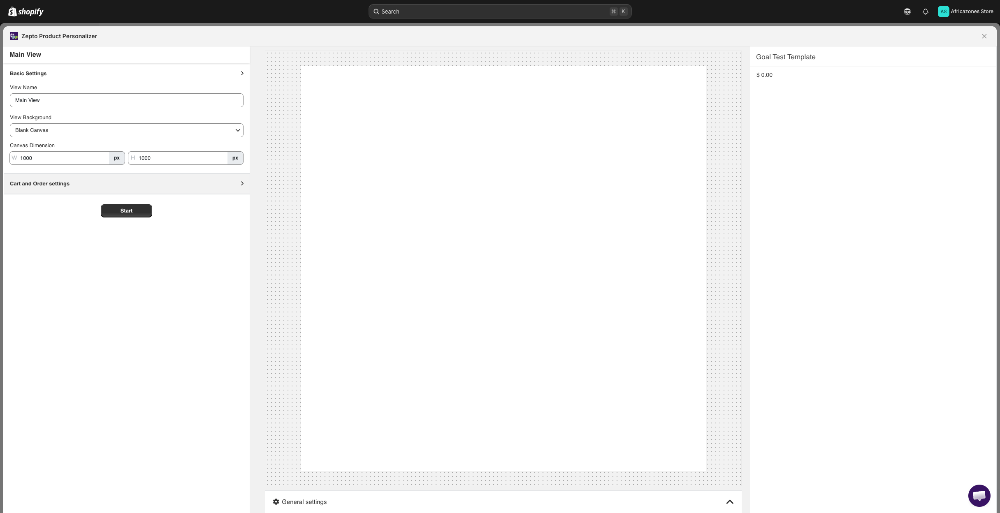
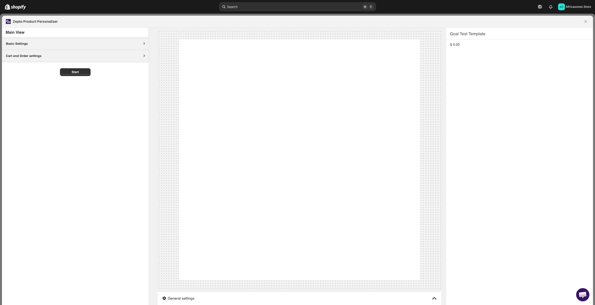

# Zepto Product Personalizer - UX Research & Analysis Report

## 1. Executive Summary
This report documents the UX research, analysis, and auditing findings of the **Zepto Product Personalizer** app integrated into the Shopify Admin. The audit focuses on the template customization workflow, editor layout, configuration options, and frontend rendering performance during key user actions.

---

## 2. Editor Workspace & Interface Structure
The customizer editor loads inside a modal overlay dialog (`Overlay`) that displays a nested iframe targeting `https://cdn-zeptoapps.com`.

### Initial Workspace Layout (Empty State)
When a template is first loaded or edited, the workspace displays a clean editor pane split into configuration sections and an interactive visual canvas.

### Interface Components
- **Top / Control Panel**: Includes general controls, a live preview toggle switch, and template status details.
- **Sidebar (Configuration Panel)**: Contains accordion panes for collapsible configuration settings:
  - **Basic Settings**: View name, background settings, and canvas dimension settings.
  - **Cart and Order Settings**: Collapsible panel specifying how custom options render in the cart.
  - **General Settings**: Accessible via the gear icon.
- **Visual Canvas / Center Panel**: Shows a representation of the personalizable area (the canvas). When empty, it displays "+ Add New Element" buttons.

---

## 3. Basic Settings Analysis
By expanding the 'Basic Settings' accordion panel, we observed the default configurations for new templates:
- **View Name**: `Main View`
- **View Background**: `Blank Canvas` (Options: *Blank Canvas*, *Uploaded Image*, *Product Image*, *Combined Variant Image*)
- **Canvas Dimension:**
  - **Width (W)**: `1000 px`
  - **Height (H)**: `1000 px`

---

## 4. Element Creation & Interactive Flow
Adding interactive options to the template canvas is done by clicking the "+ Add New Element" button, which allows users to add custom text, image uploads, dropdowns, and other input fields.

### User Interaction & Direct Canvas Manipulation
Added elements render in the layers list and directly on the visual canvas, supporting positioning, resizing, and parameter tweaking.

---

## 5. Performance Auditing & Insights
A performance trace recording was captured during the transition of editing the template and waiting for the modal customizer layout to render. The trace data has been saved to:
`docs/ux-research/traces/zepto-product-personalizer_edit-template_trace.json`

### Key Performance Insights
1. **Network Overhead**: The application requests assets dynamically from the cross-origin domain `cdn-zeptoapps.com`. Pre-fetching or bundling options could reduce visual layout shift (CLS).
2. **Iframe Overhead**: Since the editor renders inside a nested iframe, there is a minor rendering delay (LCP) as the DOM constructs the iframe context and authenticates via HMAC and Shopify ID tokens.
3. **Script Evaluation**: Long-running scripts are observed during the initialization of the canvas element library, contributing to input delay (INP) when the editor first appears.
